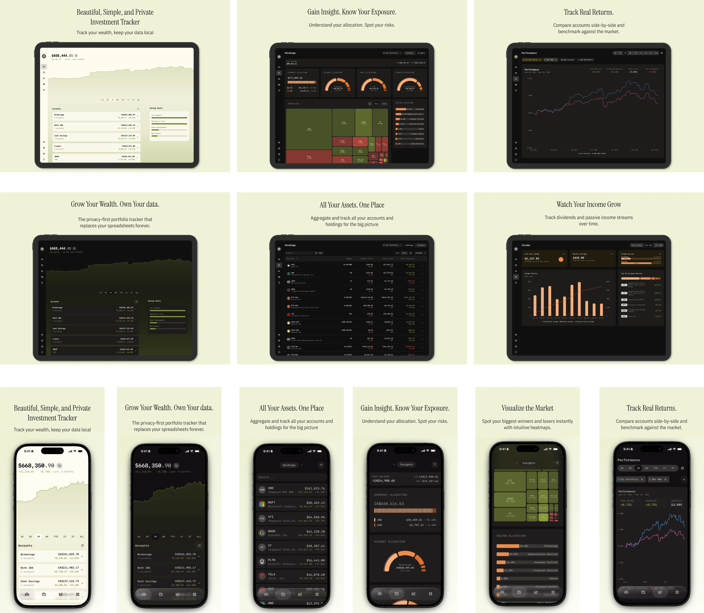

<div align="center">
  <a href="https://github.com/chipheo00/vn-wealthfolio">
    
  </a>

  <h3 align="center">WealthVN</h3>

  <p align="center">
    A Beautiful Portfolio Tracker for Vietnamese Market
    <br />
    <br />
    <a href="https://github.com/chipheo00/vn-wealthfolio">GitHub</a>
    ·
    <a href="https://github.com/chipheo00/vn-wealthfolio/releases">Releases</a>
    ·
    <a href="https://github.com/chipheo00/vn-wealthfolio/issues">Issues</a>
  </p>
</div>

## Introduction

**WealthVN** is a Beautiful Portfolio Tracker designed for the Vietnamese
market, with Local Data Storage. No Subscriptions, No Cloud.

Forked from [Wealthfolio](https://github.com/afadil/wealthfolio) by Aziz Fadil.



### Key Features

- **Portfolio Tracking** - Track your investments across multiple accounts and
  asset types
- **Performance Analytics** - Detailed performance metrics and historical
  analysis
- **Activity Management** - Import and manage all your trading activities
- **Goal Planning** - Set and track financial goals with allocation management
- **Local Data** - All data stored locally with no cloud dependencies
- **Extensible** - Powerful addon system for custom functionality
- **Multi-Currency** - Support for multiple currencies with exchange rate
  management
- **Multi-Language** - Full internationalization support (English, Vietnamese)
- **Cross-Platform** - Available on Windows, macOS, and Linux
- **VN Market Support** - Built-in support for Vietnamese stock market data

### Addon System

WealthVN features a powerful addon system that allows developers to extend
functionality:

- **Easy Development** - TypeScript SDK with full type safety and hot reload
- **Secure** - Comprehensive permission system with user consent
- **High Performance** - Optimized for speed with minimal overhead
- **UI Integration** - Add custom pages, navigation items, and components
- **Real-time Events** - Listen to portfolio updates, market sync, and user
  actions
- **Full Data Access** - Access to accounts, holdings, activities, and market
  data
- **Secrets Management** - Secure storage for API keys and sensitive data

**Get started building addons:** See the
[Addon Documentation Hub](docs/addons/index.md)

## Getting Started

### Prerequisites

Ensure you have the following installed on your machine:

- [Node.js](https://nodejs.org/)
- [pnpm](https://pnpm.io/)
- [Rust](https://www.rust-lang.org/)
- [Tauri](https://tauri.app/)

### Building from Source

1. **Clone the repository**:

   ```bash
   git clone https://github.com/chipheo00/vn-wealthfolio.git
   cd vn-wealthfolio
   ```

2. **Install dependencies using pnpm**:

   ```bash
   pnpm install
   ```

3. **Setup environment configuration**:

   Copy the environment template and configure it for your setup:

   ```bash
   cp .env.example .env
   ```

4. **Run in Development Mode**:

   Build and run the desktop application using Tauri:

   ```bash
   pnpm tauri dev
   ```

5. **Build for Production**:

   Build the application for production:

   ```bash
   pnpm tauri build
   ```

### Web Mode (Browser + REST API server)

Run the web UI with a local Axum server with one command.

1. **Setup environment** (optional but recommended):

   ```bash
   cp .env.web.example .env.web
   ```

2. **Start both backend and Vite dev server**:

   ```bash
   pnpm run dev:web
   ```

   The Vite dev server runs at `http://localhost:1420` and proxies API calls to
   the Axum backend server.

## Docker

Build and run with Docker:

```bash
# Build the image
docker build -t wealthvn .

# Run the container
docker run --rm -d \
  --name wealthvn \
  -e WF_LISTEN_ADDR=0.0.0.0:8088 \
  -e WF_DB_PATH=/data/wealthvn.db \
  -p 8088:8088 \
  -v "$(pwd)/wealthvn-data:/data" \
  wealthvn
```

Access the application at `http://localhost:8088` after starting the container.

## Technologies Used

### Frontend

- **React**: JavaScript library for building user interfaces.
- **React Router**: Declarative routing for React.
- **Tailwind CSS**: Utility-first CSS framework for styling.
- **Radix UI/Shadcn**: Accessible UI components.
- **Recharts**: Charting library built with React.
- **React Query**: Data-fetching library for React.
- **Zod**: TypeScript-first schema declaration and validation library.

### Backend

- **Tauri**: Framework for building tiny, secure, and fast desktop applications.
- **Rust**: Systems programming language for core backend functionality.
- **SQLite**: Embedded database for local data storage.
- **Diesel**: Safe, extensible ORM and query builder for Rust.

### Addon System

- **@wealthvn/addon-sdk**: TypeScript SDK for addon development with full type
  safety.
- **@wealthvn/addon-dev-tools**: CLI tools and development server for hot
  reload.
- **@wealthvn/ui**: Shared UI component library for consistent styling.

## Folder Structure

```
wealthvn/
├── src/                         # Main source code for the React application
│   ├── addons/                  # Addon system core functionality
│   ├── components/              # React components
│   ├── pages/                   # Application pages and routes
│   ├── hooks/                   # Custom React hooks
│   └── lib/                     # Utility libraries and helpers
├── src-core/                    # Core backend functionality (Rust)
├── src-tauri/                   # Tauri-specific code for desktop app functionality
├── src-server/                  # Web server (Axum)
├── addons/                      # Example and sample addons
├── packages/                    # Shared packages and tools
│   ├── addon-sdk/               # Addon SDK for developers
│   ├── addon-dev-tools/         # Development tools and CLI
│   └── ui/                      # Shared UI components library
├── docs/                        # Documentation
└── public/                      # Public assets
```

## Contributing

Contributions are welcome! Please follow these steps:

1. Fork the repository.
2. Create a new branch (`git checkout -b feature-branch`).
3. Make your changes.
4. Commit your changes (`git commit -m 'Add some feature'`).
5. Push to the branch (`git push origin feature-branch`).
6. Open a pull request.

## License

This project is licensed under the AGPL-3.0 license. See the `LICENSE` file for
details.

## Credits

- Original project: [Wealthfolio](https://github.com/afadil/wealthfolio) by Aziz
  Fadil
- WealthVN fork by: Chipheo00 - CFPM Inc. WealthVN Team

---

Enjoy managing your wealth with **WealthVN**!
