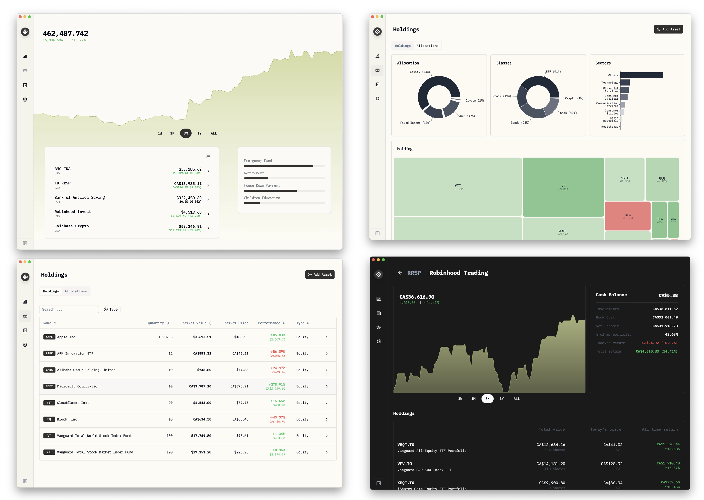

<div align="center">
  <a href="https://github.com/afadil/wealthfolio">
    
  </a>

  <h3 align="center">Wealthfolio</h3>

  <p align="center">
    A Beautiful and Boring Desktop Investment Tracker
    <br />
    <br />
    <a href="https://wealthfolio.app">Website</a>
    ·
    <a href="https://discord.gg/WDMCY6aPWK">Discord</a>
    ·
    <a href="https://x.com/intent/follow?screen_name=WealthfolioApp">Twitter</a>
    ·
    <a href="https://github.com/afadil/wealthfolio/releases">Releases</a>
  </p>
</div>
<div align="center">

[](https://www.buymeacoffee.com/afadil)

</div>

<div align="center">
<a href="https://news.ycombinator.com/item?id=41465735">
  
</a>
  <a href="https://www.producthunt.com/posts/wealthfolio?embed=true&amp;utm_source=badge-featured&amp;utm_medium=badge&amp;utm_souce=badge-wealthfolio" target="_blank"></a>

  <a href="https://trendshift.io/repositories/11701" target="_blank">
  </a>

</div>

## Introduction

**Wealthfolio App** is a Beautiful and Boring Investment Tracker, with Local
Data Storage. No Subscriptions, No Cloud.

Visit the app website at [Wealthfolio App](https://wealthfolio.app/).



### ✨ Key Features

- **📊 Portfolio Tracking** - Track your investments across multiple accounts
  and asset types
- **📈 Performance Analytics** - Detailed performance metrics and historical
  analysis
- **💰 Activity Management** - Import and manage all your trading activities
- **🎯 Goal Planning** - Set and track financial goals with allocation
  management
- **🔒 Local Data** - All data stored locally with no cloud dependencies
- **🧩 Extensible** - Powerful addon system for custom functionality
- **🌍 Multi-Currency** - Support for multiple currencies with exchange rate
  management
- **📱 Cross-Platform** - Available on Windows, macOS, and Linux

### 🧩 Addon System

Wealthfolio features a powerful addon system that allows developers to extend
functionality:

- **🔌 Easy Development** - TypeScript SDK with full type safety and hot reload
- **🔒 Secure** - Comprehensive permission system with user consent
- **⚡ High Performance** - Optimized for speed with minimal overhead
- **🎨 UI Integration** - Add custom pages, navigation items, and components
- **📡 Real-time Events** - Listen to portfolio updates, market sync, and user
  actions
- **🗄️ Full Data Access** - Access to accounts, holdings, activities, and market
  data
- **🔐 Secrets Management** - Secure storage for API keys and sensitive data

**Get started building addons:**
[Addon Developer Guide](docs/addons/addon-developer-guide.md)

Documentation for all Activity types, including the required form fields, is
available in
[docs/activities/activity-types.md](docs/activities/activity-types.md).

## Roadmap

See [ROADMAP.md](./ROADMAP.md).

## 📖 Documentation

### Core Application

- **[Activity Types](docs/activities/activity-types.md)** - Complete guide to
  all supported activity types and their required fields
- **[Roadmap](ROADMAP.md)** - Future plans and development roadmap

### Addon Development

- **[Addon Documentation Hub](docs/addons/index.md)** - Main entry point for
  addon development
- **[Developer Guide](docs/addons/addon-developer-guide.md)** - Comprehensive
  guide from setup to advanced patterns
- **[API Reference](docs/addons/addon-api-reference.md)** - Complete API
  documentation with examples
- **[Permission System](docs/addons/addon-permissions.md)** - Security and
  permission system guide
- **[Examples & Tutorials](docs/addons/addon-examples.md)** - Practical examples
  and step-by-step tutorials

### Quick Links

- 🚀
  **[Get Started with Addons](docs/addons/addon-developer-guide.md#quick-start)**
- 🔒
  **[Security Best Practices](docs/addons/addon-permissions.md#security-best-practices)**
- 💡 **[Example Addons](addons/)** - Browse sample addons in the repository
- 🛠️ **[Development Tools](packages/addon-dev-tools/)** - CLI tools for addon
  development

## Getting Started

### Prerequisites

Ensure you have the following installed on your machine:

- [Node.js](https://nodejs.org/)
- [pnpm](https://pnpm.io/)
- [Rust](https://www.rust-lang.org/)
- [Tauri](https://tauri.app/)

### Building from Source

1. **Clone the repository**:

   ```bash
   git clone https://github.com/afadil/wealthfolio.git
   cd wealthfolio
   ```

2. **Install dependencies using pnpm**:

   ```bash
   pnpm install
   ```

3. **Setup environment configuration**:

   Copy the environment template and configure it for your setup:

   ```bash
   cp .env.example .env
   ```

   Update the `.env` file with your database path and other configuration as
   needed:

   ```bash
   # Database location
   DATABASE_URL=../db/wealthfolio.db
   ```

4. **Run in Development Mode**:

Build and run the desktop application using Tauri:

```bash
pnpm tauri dev
```

5. **Build for Production**:

Build the application for production:

```bash
pnpm tauri build
```

### Web Mode (Browser + REST API server)

Run the web UI with a local Axum server with one command.

#### Quick Start

1. **Setup environment** (optional but recommended):

   Copy the example environment file and customize it for your setup:

   ```bash
   cp .env.web.example .env.web
   ```

   Edit `.env.web` to configure database path, ports, and other settings as
   needed.

2. **Start both backend and Vite dev server**:

   ```bash
   pnpm run dev:web
   ```

   The Vite dev server runs at `http://localhost:1420` and proxies API calls to
   the Axum backend server.

#### Configuration

All configuration is done via environment variables in `.env.web`.

**Server Configuration (WF_\* variables)**:

- `WF_LISTEN_ADDR` - Server bind address (default: `0.0.0.0:8080`)
- `WF_DB_PATH` - SQLite database path or directory (default: `./db/app.db`)
  - If a directory is provided, `app.db` will be used inside it
- `WF_CORS_ALLOW_ORIGINS` - Comma-separated list of allowed CORS origins
  (default: `*`)
  - Example: `http://localhost:1420,http://localhost:3000`
- `WF_REQUEST_TIMEOUT_MS` - Request timeout in milliseconds (default: `30000`)
- `WF_STATIC_DIR` - Directory for serving static frontend assets (default:
  `dist`)
- `WF_SECRET_KEY` - **Optional** 32-byte encryption key for secrets at rest
  - Generate with: `openssl rand -base64 32`
  - When unset, secrets are stored unencrypted
- `WF_SECRET_FILE` - **Optional** path to secrets storage file (default:
  `<data-root>/secrets.json`)
- `WF_ADDONS_DIR` - **Optional** path to addons directory (default: derived from
  database path)

**Vite Configuration**:

- `VITE_API_TARGET` - Backend API URL for Vite proxy (default:
  `http://127.0.0.1:8080`)

#### Notes

- The server logs the effective database path on startup
- Environment variables from `.env.web` are loaded automatically by the
  `dev:web` script
- Stop with Ctrl+C to shut down both processes gracefully

### Server Only

Run just the HTTP server without the Vite dev server (from repo root):

```bash
cargo run --manifest-path src-server/Cargo.toml
```

The server accepts the same `WF_*` environment variables as documented in the
[Web Mode Configuration](#configuration) section above. You can set them inline
or via `.env.web`:

```bash
WF_LISTEN_ADDR=127.0.0.1:8080 WF_DB_PATH=./db/app.db cargo run --manifest-path src-server/Cargo.toml
```

See [Web Mode Configuration](#configuration) for a complete list of supported
environment variables.

## Docker

### Building the Image

Build the Docker image with both frontend and backend:

```bash
docker build -t wealthfolio-web .
```

The image includes:

- Compiled frontend assets in `/app/dist`
- `wealthfolio-server` binary at `/usr/local/bin/wealthfolio-server`
- Alpine Linux base (small footprint)

### Configuration

You can configure the container using either:

1. **Environment variables** (inline with `-e` flag)
2. **Environment file** (using `--env-file` flag)

**Option 1: Create an environment file** (recommended for production):

```bash
# Create a Docker-specific environment file
cat > .env.docker << 'EOF'
WF_LISTEN_ADDR=0.0.0.0:8080
WF_DB_PATH=/data/wealthfolio.db
WF_SECRET_KEY=<generate-with-openssl-rand>
WF_CORS_ALLOW_ORIGINS=*
EOF
```

Generate and add your secret key:

```bash
echo "WF_SECRET_KEY=$(openssl rand -base64 32)" >> .env.docker
```

**Option 2: Use inline environment variables** (simpler for testing):

See examples below for inline configuration.

### Running the Container

**Using environment file** (recommended):

```bash
docker run --rm -d \
  --env-file .env.docker \
  -p 8080:8080 \
  -v "$(pwd)/wealthfolio-data:/data" \
  wealthfolio-web
```

**Basic usage** (inline environment variables):

```bash
docker run --rm -d \
  -e WF_LISTEN_ADDR=0.0.0.0:8080 \
  -e WF_DB_PATH=/data/wealthfolio.db \
  -p 8080:8080 \
  -v "$(pwd)/wealthfolio-data:/data" \
  wealthfolio-web
```

**Development mode** (with CORS for local Vite dev server):

```bash
docker run --rm -it \
  -e WF_LISTEN_ADDR=0.0.0.0:8080 \
  -e WF_DB_PATH=/data/wealthfolio.db \
  -e WF_CORS_ALLOW_ORIGINS=http://localhost:1420 \
  -p 8080:8080 \
  -v "$(pwd)/wealthfolio-data:/data" \
  wealthfolio-web
```

**Production with encryption** (recommended):

```bash
docker run --rm -d \
  -e WF_LISTEN_ADDR=0.0.0.0:8080 \
  -e WF_DB_PATH=/data/wealthfolio.db \
  -e WF_SECRET_KEY=$(openssl rand -base64 32) \
  -p 8080:8080 \
  -v "$(pwd)/wealthfolio-data:/data" \
  wealthfolio-web
```

### Environment Variables

The container supports all `WF_*` environment variables documented in the [Web
Mode Configuration](#configuration) section. Key variables:

- `WF_LISTEN_ADDR` - Bind address (use `0.0.0.0:8080` for Docker)
- `WF_DB_PATH` - Database path (typically `/data/wealthfolio.db`)
- `WF_CORS_ALLOW_ORIGINS` - CORS origins (set for dev/frontend access)
- `WF_SECRET_KEY` - Encryption key for secrets (recommended)

### Volumes

- `/data` - Persistent storage for database and secrets
  - Database: `/data/wealthfolio.db`
  - Secrets: `/data/secrets.json` (encrypted if `WF_SECRET_KEY` is set)

### Ports

- `8080` - HTTP server (serves both API and static frontend)

Access the application at `http://localhost:8080` after starting the container.

### Development with DevContainer

For a consistent development environment across all platforms, you can use the
provided DevContainer configuration. This method requires fewer manual setup
steps and provides an isolated environment with all necessary dependencies.

#### Prerequisites

- [Docker](https://www.docker.com/)
- [Visual Studio Code](https://code.visualstudio.com/)
- [Remote - Containers](https://marketplace.visualstudio.com/items?itemName=ms-vscode-remote.remote-containers)
  VS Code extension

#### Features

- Pre-configured Tauri development environment
- X11 virtual display with VNC access (port 5900)
- Complete Rust development setup
- GPU support (via Docker's --gpus=all flag)
- Persistent data and build caches
- Essential VS Code extensions pre-installed

#### Starting Development with DevContainer

1. **Clone the repository** (if you haven't already):
   ```bash
   git clone https://github.com/afadil/wealthfolio.git
   cd wealthfolio
   ```
2. **Open in VS Code**:
   - Open VS Code
   - Go to File > Open Folder
   - Select the wealthfolio directory

3. **Launch DevContainer**:
   - Press `F1` or `Ctrl+Shift+P`
   - Type "Remote-Containers: Reopen in Container"
   - Press Enter

4. **Wait for container build**:
   - VS Code will build and configure the development container
   - This may take a few minutes on first run

5. **Start Development**:
   - Once the container is ready, you can start development
   - All necessary tools and dependencies will be available

## Addon Development

Wealthfolio supports a powerful addon ecosystem that allows developers to extend
functionality with custom features.

### Quick Start with Addons

1. **Create a new addon**:

   ```bash
   npx @wealthfolio/addon-dev-tools create my-addon
   cd my-addon
   npm install
   ```

2. **Start development server**:

   ```bash
   npm run dev:server
   ```

3. **Start Wealthfolio in development mode** (in another terminal):
   ```bash
   pnpm tauri dev
   ```

Your addon will be automatically discovered and loaded with hot reload support!

### Addon Features

- **🎨 UI Integration**: Add custom pages and navigation items
- **📊 Data Access**: Full access to portfolio, accounts, and market data
- **📡 Real-time Events**: React to portfolio updates and user actions
- **🔐 Secure Storage**: Store API keys and sensitive data securely
- **⚡ Hot Reload**: Seamless development experience
- **🔒 Permission System**: Transparent security with user consent

### Example Addons

Check out the [addons/](addons/) directory for sample addons including:

- **Goal Progress Tracker**: Visual goal tracking with calendar like interface
- More examples in the [documentation](docs/addons/addon-examples.md)

### Resources

- **[Complete Developer Guide](docs/addons/addon-developer-guide.md)** -
  Everything you need to know
- **[API Reference](docs/addons/addon-api-reference.md)** - Full API
  documentation
- **[Permission System](docs/addons/addon-permissions.md)** - Security and
  permissions guide
- **[Examples & Tutorials](docs/addons/addon-examples.md)** - Step-by-step
  tutorials

## Technologies Used

### Frontend

- **React**: JavaScript library for building user interfaces.
- **React Router**: Declarative routing for React.
- **Tailwind CSS**: Utility-first CSS framework for styling.
- **Radix UI/Shadcn**: Accessible UI components.
- **Recharts**: Charting library built with React.
- **React Query**: Data-fetching library for React.
- **Zod**: TypeScript-first schema declaration and validation library.

### Backend

- **Tauri**: Framework for building tiny, secure, and fast desktop applications.
- **Rust**: Systems programming language for core backend functionality.
- **SQLite**: Embedded database for local data storage.
- **Diesel**: Safe, extensible ORM and query builder for Rust.

### Addon System

- **@wealthfolio/addon-sdk**: TypeScript SDK for addon development with full
  type safety.
- **@wealthfolio/addon-dev-tools**: CLI tools and development server for hot
  reload.
- **@wealthfolio/ui**: Shared UI component library for consistent styling.

### Development Tools

- **Vite**: Next-generation frontend tooling.
- **TypeScript**: Typed superset of JavaScript.
- **ESLint**: Pluggable linting utility for JavaScript and JSX.
- **Prettier**: Code formatter.
- **pnpm**: Fast, disk space efficient package manager.
- **Turborepo**: High-performance build system for JavaScript and TypeScript
  codebases.

## Folder Structure

```
wealthfolio/
├── src/                         # Main source code for the React application
│   ├── addons/                  # Addon system core functionality
│   ├── components/              # React components
│   ├── pages/                   # Application pages and routes
│   ├── hooks/                   # Custom React hooks
│   └── lib/                     # Utility libraries and helpers
├── src-core/                    # Core backend functionality (Rust)
├── src-tauri/                   # Tauri-specific code for desktop app functionality
├── addons/                      # Example and sample addons
│   └── goal-progress-tracker/   # Goal Progress tracker addon example
├── packages/                    # Shared packages and tools
│   ├── addon-sdk/               # Addon SDK for developers
│   ├── addon-dev-tools/         # Development tools and CLI
│   └── ui/                      # Shared UI components library
├── docs/                        # Documentation
│   ├── addons/                  # Addon development documentation
│   └── activities/              # Activity types documentation
├── public/                      # Public assets
├── db/                          # Database files and migrations
├── LICENSE                      # License file
├── README.md                    # Project documentation
├── ROADMAP.md                   # Future plans and roadmap
│
├── packages/ui/components.json  # Shadcn UI generator config (monorepo)
├── package.json                 # Node.js dependencies and scripts
├── pnpm-lock.yaml               # Lock file for pnpm
├── postcss.config.js            # PostCSS configuration
├── tailwind.config.js           # Tailwind CSS configuration
├── tsconfig.json                # TypeScript configuration
└── vite.config.ts               # Vite build tool configuration
```

### Security & Data Storage

#### Local Data Storage

All your financial data is stored locally using SQLite database with no cloud
dependencies:

- Portfolio holdings and performance data
- Trading activities and transaction history
- Account information and settings
- Goals and contribution limits

#### API Keys & Secrets

API credentials are securely stored using the operating system keyring through
the `keyring` crate:

- **Core App**: Use `set_secret` and `get_secret` commands for external services
- **Addons**: Use the Secrets API (`ctx.api.secrets`) for addon-specific
  sensitive data
- **No Disk Storage**: Keys never written to disk or configuration files

#### Permission System

Addons operate under a comprehensive permission system:

- Automatic code analysis during installation
- User consent required for data access
- Risk-based security warnings
- Transparent permission declarations

## Contributing

Contributions are welcome! Please follow these steps:

1. Fork the repository.
2. Create a new branch (`git checkout -b feature-branch`).
3. Make your changes.
4. Commit your changes (`git commit -m 'Add some feature'`).
5. Push to the branch (`git push origin feature-branch`).
6. Open a pull request.

## License

This project is licensed under the AGPL-3.0 license. See the `LICENSE` file for
details.

## 🌟 Star History

## [](https://star-history.com/#afadil/wealthfolio&Date)

Enjoy managing your wealth with **Wealthfolio**! 🚀
