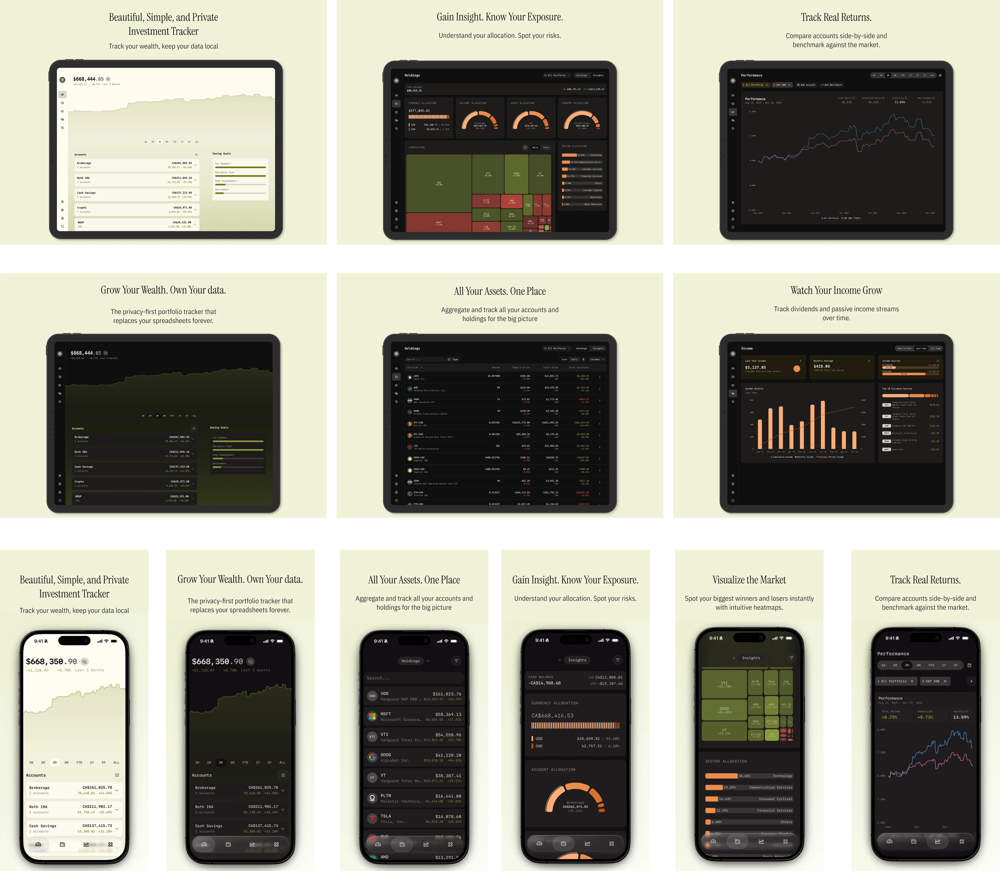

<div align="center">
  <a href="https://github.com/wealthfolio/wealthfolio">
    
  </a>

  <h3 align="center">Wealthfolio</h3>

  <p align="center">
    The open-source, private portfolio tracker — investments, net worth, spending, and simulations.
    <br />
    Local-first: your data lives on your device.
    <br />
    <br />
    <a href="https://wealthfolio.app?utm_source=github&utm_medium=readme">Website</a>
    ·
    <a href="https://discord.gg/WDMCY6aPWK">Discord</a>
    ·
    <a href="https://x.com/intent/follow?screen_name=WealthfolioApp">Twitter</a>
    ·
    <a href="https://github.com/wealthfolio/wealthfolio/releases">Releases</a>
  </p>

  <p align="center">
    <a href="https://wealthfolio.app/download?utm_source=github&utm_medium=readme&utm_campaign=cta"><strong>⬇️&nbsp;&nbsp;Download for macOS · Windows · Linux</strong></a>
    &nbsp;·&nbsp;
    <a href="https://apps.apple.com/us/app/wealthfolio-private-finance/id6732888445">📱&nbsp;iOS&nbsp;App</a>
    &nbsp;·&nbsp;
    <a href="https://wealthfolio.app/docs/guide/self-hosting/docker?utm_source=github&utm_medium=readme">🐳&nbsp;Docker</a>
  </p>
</div>
<div align="center">

[](https://www.buymeacoffee.com/afadil)

</div>

<div align="center">
<a href="https://news.ycombinator.com/item?id=41465735">
  
</a>
  <a href="https://www.producthunt.com/posts/wealthfolio?embed=true&amp;utm_source=badge-featured&amp;utm_medium=badge&amp;utm_souce=badge-wealthfolio" target="_blank"></a>

  <a href="https://trendshift.io/repositories/11701" target="_blank">
  </a>

</div>

## Introduction

**Wealthfolio** is an open-source, private portfolio tracker — investments, net
worth, spending, and simulations. All your data is stored locally on your
device: no cloud database, no account required, free forever.

For automatic brokerage syncing (30+ institutions, read-only) and encrypted
multi-device sync, there's
**[Wealthfolio Connect](https://wealthfolio.app/connect?utm_source=github&utm_medium=readme)**
— an optional subscription that covers the real cost of the brokerage data
connections. The app never requires it: manual tracking and CSV import are free,
forever.

Visit the website at
[wealthfolio.app](https://wealthfolio.app/?utm_source=github&utm_medium=readme).



### ✨ Key Features

- **📊 Portfolio Tracking** - Track your investments across multiple accounts
  and asset types
- **📈 Performance Analytics** - True time-weighted and money-weighted returns,
  benchmark comparison, and historical analysis
- **💰 Activity Management** - Import and manage all your trading activities
- **🎯 Goal Planning** - Set and track financial goals with allocation
  management
- **🔒 Local Data** - All data stored locally with no cloud dependencies
- **🔄 Optional Broker Sync** - Auto-sync 30+ brokerages with
  [Wealthfolio Connect](https://wealthfolio.app/connect?utm_source=github&utm_medium=readme)
  (read-only, entirely optional)
- **🧩 Extensible** - Powerful addon system for custom functionality
- **🌍 Multi-Currency** - Support for multiple currencies with exchange rate
  management
- **📱 Cross-Platform** - Desktop (Windows, macOS, Linux), iOS, and self-hosted
  Docker/web

Wealthfolio 3.7 requires macOS 12 or newer and iOS/iPadOS 16 or newer. macOS 12
installations should apply current macOS and Safari updates so the system
WKWebView meets the Safari 16 browser floor. Windows uses the evergreen WebView2
runtime; Linux and self-hosted installations should keep WebKitGTK or their
browser updated.

### 🧩 Addon System

Wealthfolio features a powerful addon system that allows developers to extend
functionality:

- **🔌 Easy Development** - TypeScript SDK with full type safety and hot reload
- **🔒 Secure** - Comprehensive permission system with user consent
- **⚡ High Performance** - Optimized for speed with minimal overhead
- **🎨 UI Integration** - Add custom pages, navigation items, and components
- **📡 Real-time Events** - Listen to portfolio updates, market sync, and user
  actions
- **🗄️ Full Data Access** - Access to accounts, holdings, activities, and market
  data
- **🔐 Secrets Management** - Secure storage for API keys and sensitive data
- **📦 Private Assets** - Package images, fonts, media, configuration, and Wasm
  for the isolated addon sandbox

**Get started building addons:** See the
[Addon Documentation Hub](docs/addons/index.md)

Documentation for all Activity types, including the required form fields, is
available in
[docs/activities/activity-types.md](docs/activities/activity-types.md).

## Roadmap

See [ROADMAP.md](./ROADMAP.md).

## 📖 Documentation

### Core Application

- **[Activity Types](docs/activities/activity-types.md)** - Complete guide to
  all supported activity types and their required fields
- **[Roadmap](ROADMAP.md)** - Future plans and development roadmap

### Architecture

- **[Adapter System](docs/architecture/adapters.md)** - Compile-time environment
  detection for Desktop/Web builds

### Addon Development

- **[Addon Documentation Hub](docs/addons/index.md)** - Main entry point for
  addon development
- **[Getting Started](docs/addons/addon-getting-started.md)** - Guide to get
  started with addon development
- **[API Reference](docs/addons/addon-api-reference.md)** - Complete API
  documentation with examples
- **[Architecture](docs/addons/addon-architecture.md)** - Design patterns and
  architecture guide
- **[v3.6 to v3.7 Migration](docs/addons/addon-migration-guide-v3.6-to-v3.7.md)** -
  Packaged assets and compatibility notes

### Quick Links

- 💡 **Official Addons** - Browse maintained addon examples in the
  [official addon repository](https://github.com/wealthfolio/wealthfolio-addons/tree/main/official)
- 🧩 **Community Addons** - Browse addons shared by the community in the
  [community addon directory](https://github.com/wealthfolio/wealthfolio-addons/tree/main/community)
- 🛠️ **[Development Tools](packages/addon-dev-tools/)** - CLI tools for addon
  development

## Getting Started

### Prerequisites

Ensure you have the following installed on your machine:

- [Node.js](https://nodejs.org/)
- [pnpm](https://pnpm.io/)
- [Rust](https://www.rust-lang.org/)
- [Tauri](https://tauri.app/)

### Building from Source

1. **Clone the repository**:

   ```bash
   git clone https://github.com/wealthfolio/wealthfolio.git
   cd wealthfolio
   ```

2. **Install dependencies using pnpm**:

   ```bash
   pnpm install
   ```

3. **Setup environment configuration**:

   Copy the environment template and configure it for your setup:

   ```bash
   cp .env.example .env
   ```

   Update the `.env` file with your database path and other configuration as
   needed:

   ```bash
   # Database location
   DATABASE_URL=../db/wealthfolio.db
   ```

4. **Run in Development Mode**:

Build and run the desktop application using Tauri:

```bash
pnpm tauri dev
```

#### Addon Development Mode

Addon hot reload servers now start only when you explicitly opt in.

**For desktop development with Tauri:**

```bash
VITE_ENABLE_ADDON_DEV_MODE=true pnpm tauri dev
```

**For browser-only development (Vite only, no Tauri):**

```bash
pnpm dev:addons
```

You can also set `VITE_ENABLE_ADDON_DEV_MODE=true` in your `.env` file to
persist the setting.

5. **Build for Production**:

Build the application for production:

```bash
pnpm tauri build
```

### Web Mode (Browser + REST API server)

Run the web UI with a local Axum server with one command.

#### Quick Start

1. **Setup environment** (optional but recommended):

   Copy the example environment file and customize it for your setup:

   ```bash
   cp .env.web.example .env.web
   ```

   Edit `.env.web` to configure database path, ports, and other settings as
   needed.

2. **Start both backend and Vite dev server**:

   ```bash
   pnpm run dev:web
   ```

   The Vite dev server runs at `http://localhost:1420` and proxies API calls to
   the Axum backend server.

#### Configuration

All configuration is done via environment variables in `.env.web`.

**Server Configuration (WF\_\* variables)**:

- `WF_LISTEN_ADDR` - Server bind address (default: `0.0.0.0:8088`)
- `WF_DB_PATH` - SQLite database path or directory (default: `./db/app.db`)
  - If a directory is provided, `app.db` will be used inside it
- `WF_CORS_ALLOW_ORIGINS` - Comma-separated list of allowed CORS origins
  (default: `*`). **Required when auth is enabled** — wildcard `*` is rejected.
  - Example: `https://wealthfolio.example.com`
- `WF_REQUEST_TIMEOUT_MS` - Request timeout in milliseconds (default: `30000`)
- `WF_STATIC_DIR` - Directory for serving static frontend assets (default:
  `dist`)
- `WF_SECRET_KEY` - **Required** 32-byte key used for secrets encryption and JWT
  signing
  - Generate with: `openssl rand -base64 32`
- `WF_AUTH_PASSWORD_HASH` - Argon2id PHC string enabling password-only
  authentication for web mode
- `WF_AUTH_TOKEN_TTL_MINUTES` - Optional JWT access token expiry in minutes
  (default `60`)
- `WF_AUTH_REQUIRED` - Set to `false` to allow starting on non-loopback
  addresses without authentication (e.g. when a reverse proxy handles auth)
- OIDC / SSO (optional) - sign in via any OpenID Connect provider (Authentik,
  PocketID, Authelia, Keycloak, …). Works alongside or instead of
  `WF_AUTH_PASSWORD_HASH`; a successful SSO login mints the same session cookie.
  Enabled when both `WF_OIDC_ISSUER_URL` and `WF_OIDC_CLIENT_ID` are set.
  - `WF_OIDC_ISSUER_URL` - provider base URL (discovery hits
    `<issuer>/.well-known/openid-configuration`)
  - `WF_OIDC_CLIENT_ID` - client id registered with the IdP
  - `WF_OIDC_CLIENT_SECRET` - **Optional** client secret (PKCE is always used)
  - `WF_OIDC_REDIRECT_URL` - **Required** when OIDC is enabled; must be
    registered in the IdP, e.g. `https://your.host/api/v1/auth/oidc/callback`
  - `WF_OIDC_SCOPES` - **Optional** space-separated scopes (default
    `openid email profile`)
  - `WF_OIDC_ALLOWED_EMAILS` / `WF_OIDC_ALLOWED_SUBS` - comma-separated
    allowlists matched against the ID token's `email` / `sub` claims. With
    neither set, the server **refuses to start** unless `WF_OIDC_ALLOW_ANY=true`
    is also set — a missing allowlist must never silently grant every IdP user
    access. An `email` is only honored when the IdP asserts
    `email_verified=true`; `WF_OIDC_ALLOWED_SUBS` is the stronger control
    (stable, issuer-scoped) and is recommended on shared/multi-tenant IdPs.
  - `WF_OIDC_ALLOW_ANY` - **Optional**, default `false`. Set to `true` to allow
    **any** user the IdP authenticates when no allowlist is configured. Only
    safe on a dedicated single-user IdP; on a shared/multi-tenant IdP this
    grants everyone access. A warning is logged at startup when enabled.
  - `WF_OIDC_POST_LOGOUT_REDIRECT_URL` - **Optional**. When the IdP advertises
    an `end_session_endpoint`, sign-out also ends the IdP session (RP-Initiated
    Logout); otherwise logout is local-only. Set this to land back on the app
    afterward — it must be **registered** with the IdP (e.g. Keycloak's "Valid
    post logout redirect URIs"). If unset, the IdP shows its own logged-out
    page.
  - `WF_OIDC_RP_LOGOUT` - **Optional**, default `true`. Set to `false` to force
    local-only logout even when the IdP supports RP-Initiated Logout.
- `WF_COOKIE_SECURE` - Controls the `Secure` attribute on session cookies
  (default: `auto`)
  - `auto` - set `Secure` only when `X-Forwarded-Proto: https` is present
    (recommended for most reverse-proxy setups)
  - `true` - always set `Secure` (use when TLS is guaranteed but the header is
    absent)
  - `false` - never set `Secure` (plain HTTP without a reverse proxy)
- `WF_SECRET_FILE` - **Optional** path to secrets storage file (default:
  `<data-root>/secrets.json`)
- `WF_ADDONS_DIR` - **Optional** path to addons directory (default: derived from
  database path)

**Vite Configuration**:

- `VITE_API_TARGET` - Backend API URL for Vite proxy (default:
  `http://127.0.0.1:8088`)

#### Authentication (Web Mode)

- Set `WF_AUTH_PASSWORD_HASH` to an Argon2id PHC string to require a password
  before accessing the Web App.

  You can generate the hash with online tools like
  [argon2.online](https://argon2.online) or the CLI (`argon2-utils` package):

  ```bash
  printf 'your-password' | argon2 yoursalt16chars! -id -e
  ```

  > **Tips:**
  >
  > - The first argument is the **salt** (use 16+ characters); the password is
  >   read from stdin.
  > - Use `printf` instead of `echo -n` to avoid hidden newline issues.
  > - For Docker Compose `.env` / `--env-file`, single-quote the hash or double
  >   every `$` (`$$argon2id$$...`).

  Copy the full output (starting with `$argon2id$...`) into `.env.web`.

  **Dollar-sign (`$`) escaping cheat-sheet** — Argon2 hashes contain `$`
  characters that shells and Compose interpret as variable references:

  | Context                            | Syntax                                  | Notes                                            |
  | ---------------------------------- | --------------------------------------- | ------------------------------------------------ |
  | `.env.web` / app-loaded dotenv     | `WF_AUTH_PASSWORD_HASH=$argon2id$...`   | Loaded by the app; no Compose interpolation      |
  | Docker Compose `.env`/`--env-file` | `WF_AUTH_PASSWORD_HASH='$argon2id$...'` | Single quotes prevent Compose interpolation      |
  | Docker Compose `.env`/`--env-file` | `WF_AUTH_PASSWORD_HASH=$$argon2id$$...` | Alternative: double every `$`                    |
  | Docker Compose YAML inline         | `HASH: '$$argon2id$$v=19$$...'`         | Double every `$` to escape Compose interpolation |
  | `docker run` (single quotes)       | `-e HASH='$argon2id$...'`               | Single quotes prevent shell expansion            |
  | `docker run` (double quotes)       | `-e HASH="\$argon2id\$..."`             | Backslash-escape each `$`                        |

- Sessions are cookie-based (`HttpOnly`, `SameSite=Lax`, `Path=/api`). The login
  endpoint sets the session cookie automatically — no token is exposed to
  client-side JavaScript. Sessions last 60 minutes by default (see
  `WF_AUTH_TOKEN_TTL_MINUTES`).

- **Reverse proxy (HTTPS):** If your reverse proxy terminates TLS, ensure it
  forwards `X-Forwarded-Proto: https` so the server sets the `Secure` cookie
  attribute correctly. Alternatively, set `WF_COOKIE_SECURE=true` to always set
  `Secure`. See `WF_COOKIE_SECURE` above.

#### Notes

- The server logs the effective database path on startup
- Environment variables from `.env.web` are loaded automatically by the
  `dev:web` script
- Stop with Ctrl+C to shut down both processes gracefully

### Server Only

Run just the HTTP server without the Vite dev server (from repo root):

```bash
cargo run --manifest-path apps/server/Cargo.toml
```

The server accepts the same `WF_*` environment variables as documented in the
[Web Mode Configuration](#configuration) section above. You can set them inline
or via `.env.web`:

```bash
WF_LISTEN_ADDR=127.0.0.1:8088 WF_DB_PATH=./db/app.db cargo run --manifest-path apps/server/Cargo.toml
```

See [Web Mode Configuration](#configuration) for a complete list of supported
environment variables.

## Docker

You can either pull the official Docker image or build it yourself locally.

### Using the Pre-built Image

The latest server build is published to Docker Hub.

```bash
docker pull wealthfolio/wealthfolio:latest
```

After pulling, use `wealthfolio/wealthfolio:latest` in the run commands below.
If you build the image locally, swap the image name back to `wealthfolio`.

> **Legacy image:** the same build is also mirrored to `afadil/wealthfolio` so
> existing `compose.yml` files keep working. New deployments should prefer
> `wealthfolio/wealthfolio`.

### Building the Image

Build the Docker image directly from source (no pre-build required):

```bash
docker build -t wealthfolio .
```

The build process:

1. Builds frontend assets from source (`pnpm install` + `pnpm vite build`)
2. Compiles Rust backend from source (`cargo build --release`)
3. Creates minimal Alpine-based image with only the runtime artifacts

The final image includes:

- Compiled frontend assets in `/app/dist`
- `wealthfolio-server` binary at `/usr/local/bin/wealthfolio-server`
- Alpine Linux base (small footprint)

### Configuration

You can configure the container using either:

1. **Environment variables** (inline with `-e` flag)
2. **Environment file** (using `--env-file` flag)

**Option 1: Create a Docker Compose environment file** (recommended for
production):

```bash
SECRET=$(openssl rand -base64 32)
HASH=$(printf 'your-password' | argon2 yoursalt16chars! -id -e)

cat > .env.docker << EOF
WF_LISTEN_ADDR=0.0.0.0:8088
WF_DB_PATH=/data/wealthfolio.db
WF_SECRET_KEY='${SECRET}'
WF_AUTH_PASSWORD_HASH='${HASH}'
WF_CORS_ALLOW_ORIGINS=http://localhost:8088
WF_REQUEST_TIMEOUT_MS=30000
WF_STATIC_DIR=dist
EOF
```

Set `WF_CORS_ALLOW_ORIGINS` to the exact URL you will use in your browser, such
as `http://192.168.1.10:8088` or `https://wealthfolio.example.com`.

**Option 2: Use inline environment variables** (simpler for testing):

See examples below for inline configuration.

### Running the Container

All examples below use the published image (`wealthfolio/wealthfolio:latest`).
If you built locally, substitute your local tag (e.g., `wealthfolio`).

**Docker Compose** (recommended):

```bash
docker compose --env-file .env.docker up -d
```

This publishes the app at `http://localhost:8088` by default. Set `WF_PORT` to
change the host port:

```bash
WF_PORT=8090 docker compose --env-file .env.docker up -d
```

**Docker Compose behind a reverse proxy**:

```bash
docker compose --env-file .env.docker -f compose.yml -f compose.proxy.yml up -d
```

Use this when the proxy runs on the same Docker network and forwards traffic to
`http://wealthfolio:8088`.

**Using Docker CLI environment file**:

Docker CLI `--env-file` keeps `$` characters as-is, so use raw values without
Compose escaping:

```bash
SECRET=$(openssl rand -base64 32)
HASH=$(printf 'your-password' | argon2 yoursalt16chars! -id -e)

cat > .env.docker-run << EOF
WF_LISTEN_ADDR=0.0.0.0:8088
WF_DB_PATH=/data/wealthfolio.db
WF_SECRET_KEY=${SECRET}
WF_AUTH_PASSWORD_HASH=${HASH}
WF_CORS_ALLOW_ORIGINS=http://localhost:8088
WF_REQUEST_TIMEOUT_MS=30000
WF_STATIC_DIR=dist
EOF
```

```bash
docker run --rm -d \
  --name wealthfolio \
  --env-file .env.docker-run \
  -p 8088:8088 \
  -v wealthfolio-data:/data \
  wealthfolio/wealthfolio:latest
```

**Basic usage** (inline environment variables, testing only):

```bash
docker run --rm -d \
  --name wealthfolio \
  -e WF_LISTEN_ADDR=0.0.0.0:8088 \
  -e WF_DB_PATH=/data/wealthfolio.db \
  -e WF_SECRET_KEY="$(openssl rand -base64 32)" \
  -e WF_AUTH_REQUIRED=false \
  -p 8088:8088 \
  -v wealthfolio-data:/data \
  wealthfolio/wealthfolio:latest
```

**Development mode** (with CORS for local Vite dev server, no built-in auth):

```bash
docker run --rm -it \
  --name wealthfolio \
  -e WF_LISTEN_ADDR=0.0.0.0:8088 \
  -e WF_DB_PATH=/data/wealthfolio.db \
  -e WF_CORS_ALLOW_ORIGINS=http://localhost:1420 \
  -e WF_SECRET_KEY="$(openssl rand -base64 32)" \
  -e WF_AUTH_REQUIRED=false \
  -p 8088:8088 \
  -v wealthfolio-data:/data \
  wealthfolio/wealthfolio:latest
```

**Production with encryption** (recommended):

```bash
docker run --rm -d \
  --name wealthfolio \
  -e WF_LISTEN_ADDR=0.0.0.0:8088 \
  -e WF_DB_PATH=/data/wealthfolio.db \
  -e WF_SECRET_KEY="$(openssl rand -base64 32)" \
  -e WF_AUTH_PASSWORD_HASH="$(printf 'your-password' | argon2 yoursalt16chars! -id -e)" \
  -e WF_CORS_ALLOW_ORIGINS=https://wealthfolio.example.com \
  -p 8088:8088 \
  -v wealthfolio-data:/data \
  wealthfolio/wealthfolio:latest
```

### Environment Variables

The container supports all `WF_*` environment variables documented in the
[Web Mode Configuration](#configuration) section. Key variables:

- `WF_LISTEN_ADDR` - Bind address (**must use `0.0.0.0:PORT` for Docker**, not
  `127.0.0.1`)
- `WF_DB_PATH` - Database path (typically `/data/wealthfolio.db`)
- `WF_CORS_ALLOW_ORIGINS` - CORS origins (set for dev/frontend access)
- `WF_SECRET_KEY` - Required 32-byte key used for secrets encryption and JWT
  signing

### Volumes

- `/data` - Persistent storage for database and secrets
  - Database: `/data/wealthfolio.db`
  - Secrets: `/data/secrets.json` (encrypted with `WF_SECRET_KEY`)

### Ports

- `8088` - HTTP server (serves both API and static frontend)

Access the application at `http://localhost:8088` after starting the container.

**Important:** The server must bind to `0.0.0.0` (all interfaces) inside the
container to be accessible from your host machine. Binding to `127.0.0.1` will
make the app only accessible from within the container.

### Development with DevContainer

For a consistent development environment across all platforms, you can use the
provided DevContainer configuration. This method requires fewer manual setup
steps and provides an isolated environment with all necessary dependencies.

#### Prerequisites

- [Docker](https://www.docker.com/)
- [Visual Studio Code](https://code.visualstudio.com/)
- [Remote - Containers](https://marketplace.visualstudio.com/items?itemName=ms-vscode-remote.remote-containers)
  VS Code extension

#### Features

- Pre-configured Tauri development environment
- X11 virtual display with VNC access (port 5900)
- Complete Rust development setup
- GPU support (via Docker's --gpus=all flag)
- Persistent data and build caches
- Essential VS Code extensions pre-installed

#### Starting Development with DevContainer

1. **Clone the repository** (if you haven't already):
   ```bash
   git clone https://github.com/wealthfolio/wealthfolio.git
   cd wealthfolio
   ```
2. **Open in VS Code**:
   - Open VS Code
   - Go to File > Open Folder
   - Select the wealthfolio directory

3. **Launch DevContainer**:
   - Press `F1` or `Ctrl+Shift+P`
   - Type "Remote-Containers: Reopen in Container"
   - Press Enter

4. **Wait for container build**:
   - VS Code will build and configure the development container
   - This may take a few minutes on first run

5. **Start Development**:
   - Once the container is ready, you can start development
   - All necessary tools and dependencies will be available

## Addon Development

Wealthfolio supports a powerful addon ecosystem that allows developers to extend
functionality with custom features.

### Quick Start with Addons

1. **Create a new addon**:

   ```bash
   npx @wealthfolio/addon-dev-tools create my-addon
   cd my-addon
   npm install
   ```

2. **Start development server**:

   ```bash
   npm run dev:server
   ```

3. **Start Wealthfolio in addon development mode** (in another terminal):
   ```bash
   VITE_ENABLE_ADDON_DEV_MODE=true pnpm tauri dev
   ```

Your addon will be automatically discovered and loaded with hot reload support!

### Addon Features

- **🎨 UI Integration**: Add custom pages and navigation items
- **📊 Data Access**: Full access to portfolio, accounts, and market data
- **📡 Real-time Events**: React to portfolio updates and user actions
- **🔐 Secure Storage**: Store API keys and sensitive data securely
- **⚡ Hot Reload**: Seamless development experience
- **🔒 Permission System**: Transparent security with user consent
- **📦 Private Assets**: Sandbox-safe packaged images, fonts, media, and Wasm

### Official Addons

Check out the
[official addon repository](https://github.com/wealthfolio/wealthfolio-addons/tree/main/official)
for maintained addon examples including:

- **Goal Progress Tracker**: Visual goal tracking with calendar like interface
- **Investment Fees Tracker**: Track and analyze investment fees
- **Swingfolio**: Track swing trading performance and open positions

### Resources

- **[Getting Started Guide](docs/addons/addon-getting-started.md)** - Everything
  you need to know to start building addons
- **[API Reference](docs/addons/addon-api-reference.md)** - Full API
  documentation
- **[Architecture Guide](docs/addons/addon-architecture.md)** - Design patterns
  and best practices
- **[v3.6 to v3.7 Migration Guide](docs/addons/addon-migration-guide-v3.6-to-v3.7.md)** -
  Asset packaging and compatibility

## Technologies Used

### Frontend

- **React**: JavaScript library for building user interfaces.
- **React Router**: Declarative routing for React.
- **Tailwind CSS**: Utility-first CSS framework for styling.
- **Radix UI/Shadcn**: Accessible UI components.
- **Recharts**: Charting library built with React.
- **React Query**: Data-fetching library for React.
- **Zod**: TypeScript-first schema declaration and validation library.

### Backend

- **Tauri**: Framework for building tiny, secure, and fast desktop applications.
- **Rust**: Systems programming language for core backend functionality.
- **SQLite**: Embedded database for local data storage.
- **Diesel**: Safe, extensible ORM and query builder for Rust.

### Addon System

- **@wealthfolio/addon-sdk**: TypeScript SDK for addon development with full
  type safety.
- **@wealthfolio/addon-dev-tools**: CLI tools and development server for hot
  reload.
- **@wealthfolio/ui**: Shared UI component library for consistent styling.

### Development Tools

- **Vite**: Next-generation frontend tooling.
- **TypeScript**: Typed superset of JavaScript.
- **ESLint**: Pluggable linting utility for JavaScript and JSX.
- **Prettier**: Code formatter.
- **pnpm**: Fast, disk space efficient package manager.
- **Turborepo**: High-performance build system for JavaScript and TypeScript
  codebases.

## Folder Structure

```
wealthfolio/
├── apps/                        # Application packages
│   ├── frontend/                # React frontend application
│   │   ├── src/                 # Source code
│   │   │   ├── adapters/        # Environment adapters (Tauri/Web)
│   │   │   ├── addons/          # Addon system runtime
│   │   │   ├── components/      # React components
│   │   │   ├── features/        # Feature modules (self-contained)
│   │   │   ├── pages/           # Application pages and routes
│   │   │   ├── hooks/           # Custom React hooks
│   │   │   └── lib/             # Utility libraries and helpers
│   │   ├── public/              # Static assets
│   │   ├── index.html           # HTML entry point
│   │   └── vite.config.ts       # Vite build config
│   ├── tauri/                   # Tauri desktop/mobile app (Rust IPC commands)
│   └── server/                  # Axum HTTP server for web mode
├── crates/                      # Rust crates (shared backend logic)
│   ├── core/                    # Core business logic, services, models
│   ├── storage-sqlite/          # SQLite storage layer (Diesel ORM)
│   ├── market-data/             # Market data providers
│   ├── connect/                 # External service integrations
│   └── device-sync/             # Device sync functionality
├── packages/                    # Shared TypeScript packages
│   ├── addon-sdk/               # Addon SDK for developers
│   ├── addon-dev-tools/         # CLI and dev server for addons
│   └── ui/                      # Shared UI components (@wealthfolio/ui)
├── docs/                        # Documentation
│   ├── addons/                  # Addon development docs
│   ├── activities/              # Activity types docs
│   └── architecture/            # Architecture docs
├── e2e/                         # End-to-end tests
├── scripts/                     # Build and dev scripts
├── Cargo.toml                   # Rust workspace config
├── package.json                 # Node.js dependencies
├── pnpm-workspace.yaml          # pnpm workspace config
└── tsconfig.json                # TypeScript config
```

Official and community addon source lives in the separate
[wealthfolio-addons](https://github.com/wealthfolio/wealthfolio-addons)
repository.

### Security & Data Storage

#### Local Data Storage

All your financial data is stored locally using SQLite database with no cloud
dependencies:

- Portfolio holdings and performance data
- Trading activities and transaction history
- Account information and settings
- Goals and contribution limits

#### API Keys & Secrets

API credentials are securely stored using the operating system keyring through
the `keyring` crate:

- **Core App**: Use `set_secret` and `get_secret` commands for external services
- **Addons**: Use the Secrets API (`ctx.api.secrets`) for addon-specific
  sensitive data
- **No Disk Storage**: Keys never written to disk or configuration files

#### Permission System

Addons operate under a comprehensive permission system:

- Automatic code analysis during installation
- User consent required for data access
- Risk-based security warnings
- Transparent permission declarations

## Contributing

Contributions are welcome! Please follow these steps:

1. Fork the repository.
2. Create a new branch (`git checkout -b feature-branch`).
3. Make your changes.
4. Commit your changes (`git commit -m 'Add some feature'`).
5. Push to the branch (`git push origin feature-branch`).
6. Open a pull request.

## License

This project is licensed under the AGPL-3.0 license. See the `LICENSE` file for
details.

Brand assets in `assets/brand/` are trademarks; see
[TRADEMARKS.md](TRADEMARKS.md).

---

Wealthfolio and the Wealthfolio logo are trademarks of Teymz Inc. The code is
licensed under AGPL-3.0; trademarks are not granted under that license.

## 🌟 Star History

## [](https://star-history.com/#wealthfolio/wealthfolio&Date)

Enjoy managing your wealth with **Wealthfolio**! 🚀
