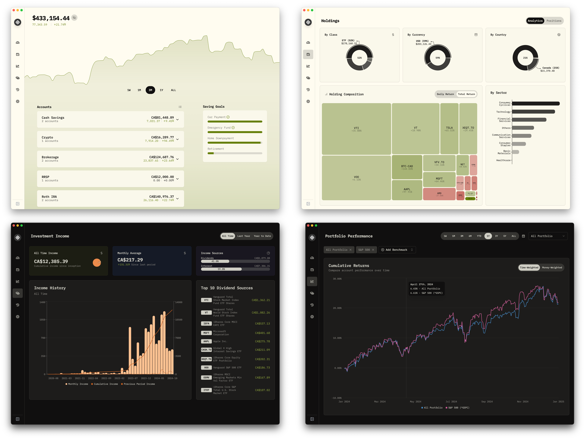

<div align="center">
  <a href="https://github.com/afadil/wealthfolio">
    
  </a>

  <h3 align="center">Wealthfolio</h3>

  <p align="center">
    A Beautiful and Boring Desktop Investment Tracker
    <br />
    <br />
    <a href="https://wealthfolio.app">Website</a>
    ·
    <a href="https://discord.gg/KFWg22au">Discord</a>
    ·
    <a href="https://x.com/intent/follow?screen_name=WealthfolioApp">Twitter</a>
    ·
    <a href="https://github.com/afadil/wealthfolio/releases">Releases</a>
  </p>
</div>
<div align="center">

[](https://www.buymeacoffee.com/afadil)

</div>

## Introduction

**Wealthfolio App** is a Beautiful and Boring Investment Tracker, with Local Data Storage. No
Subscriptions, No Cloud.

Visit the app website at [Wealthfolio App](https://wealthfolio.app/).



## Roadmap

See [ROADMAP.md](./ROADMAP.md).

## Getting Started

### Prerequisites

Ensure you have the following installed on your machine:

- [Node.js](https://nodejs.org/)
- [pnpm](https://pnpm.io/)
- [Rust](https://www.rust-lang.org/)
- [Tauri](https://tauri.app/)

### Installation

1. **Clone the repository**:

   ```bash
   git clone https://github.com/afadil/wealthfolio.git
   cd wealthfolio
   ```

2. **Install dependencies using pnpm**:

   ```bash
   pnpm install
   ```

### Running the Application

- **Development Mode**:

  Build and run the desktop application using Tauri:

  ```bash
  pnpm tauri dev
  ```

- **Build for Production**:

  Build the application for production:

  ```bash
  pnpm tauri build
  ```

## Technologies Used

### Frontend

- **React**: JavaScript library for building user interfaces.
- **React Router**: Declarative routing for React.
- **Tailwind CSS**: Utility-first CSS framework for styling.
- **Radix UI/Shadcn**: Accessible UI components.
- **Recharts**: Charting library built with React.

### Backend / APIs

- **React Query**: Data-fetching library for React.
- **Zod**: TypeScript-first schema declaration and validation library.

### Development Tools

- **Vite**: Next-generation frontend tooling.
- **TypeScript**: Typed superset of JavaScript.
- **ESLint**: Pluggable linting utility for JavaScript and JSX.
- **Prettier**: Code formatter.
- **Tauri**: Framework for building tiny, secure, and fast desktop applications.

## Folder Structure

```
wealthfolio/
├── .github/
│   └── workflows/
│       └── release.yml
├── public/
├── src/
│   ├── assets/
│   ├── commands/
│   ├── components/
│   ├── lib/
│   ├── pages/
│   ├── App.tsx
│   ├── main.tsx
│   ├── routes.tsx
│   ├── styles.css
│   ├── useGlobalEventListener.ts
│   └── vite-env.d.ts
├── src-tauri/
│   ├── icons/
│   ├── migrations/
│   ├── src/
│   ├── target/
│   ├── .gitignore
│   ├── build.rs
│   ├── Cargo.lock
│   ├── Cargo.toml
│   ├── diesel.toml
│   ├── tauri.conf.json
├── .env
├── .eslintrc.cjs
├── .gitignore
├── .prettierrc.cjs
├── components.json
├── index.html
├── package.json
├── pnpm-lock.yaml
├── postcss.config.js
├── README.md
├── tailwind.config.js
├── tsconfig.json
└── vite.config.ts
```

## Contributing

Contributions are welcome! Please follow these steps:

1. Fork the repository.
2. Create a new branch (`git checkout -b feature-branch`).
3. Make your changes.
4. Commit your changes (`git commit -m 'Add some feature'`).
5. Push to the branch (`git push origin feature-branch`).
6. Open a pull request.

## License

This project is licensed under the LGPL-3.0 license. See the `LICENSE` file for details.

## 🌟 Star History

## [](https://star-history.com/#afadil/wealthfolio&Date)

Enjoy managing your wealth with **Wealthfolio**! 🚀
