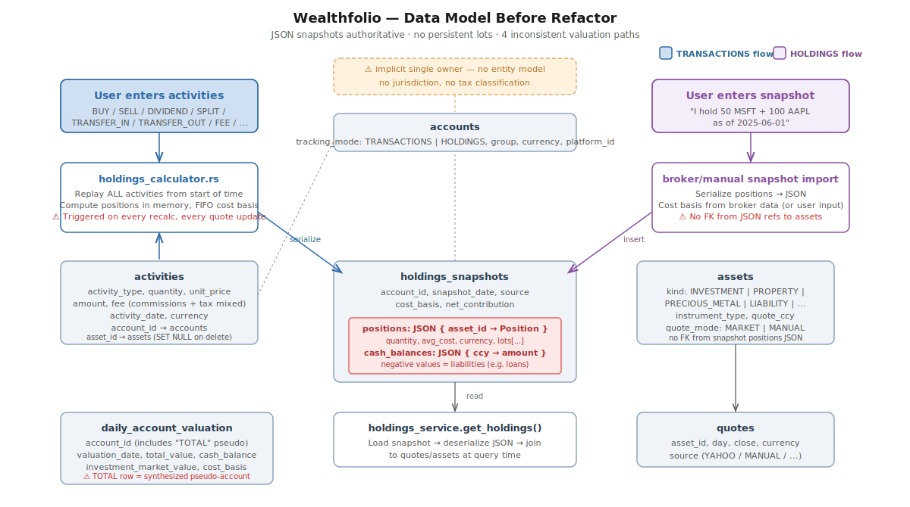
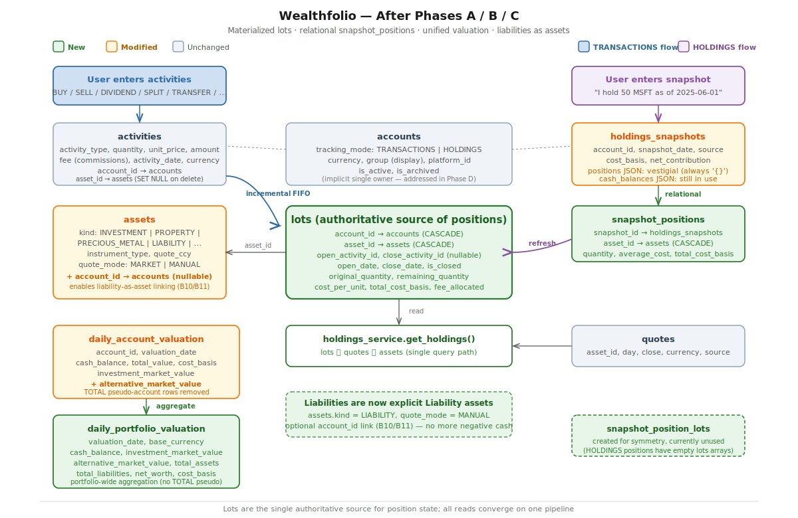
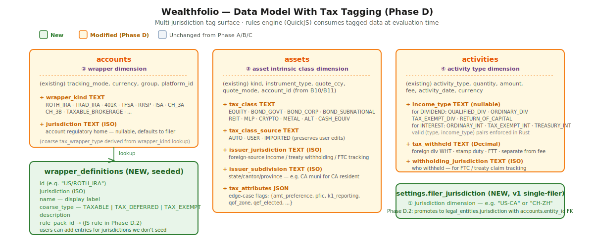
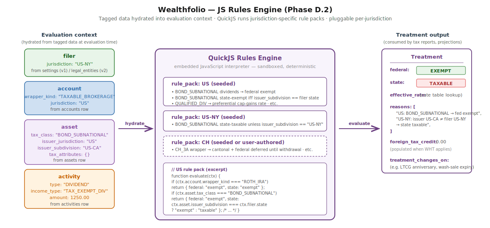

# Wealthfolio Data Model — Refactor & Tax-Support Proposal

## Abstract

This document summarizes a multi-phase refactor of Wealthfolio's data
model and proposes a tagging surface for future tax support. It covers:

- **Phases A, B, C** — structural refactor of the position/valuation
  model. Materialized tax lots, relational snapshot positions, unified
  valuation pipeline, liabilities as first-class assets. Shipped as (pending) PRs
  [#792](https://github.com/afadil/wealthfolio/pull/792), [#831](https://github.com/afadil/wealthfolio/pull/831), and [#842](https://github.com/afadil/wealthfolio/pull/842).
- **Phase D (proposed)** — a minimal multi-jurisdiction tagging surface
  for assets, accounts, and activities, plus a QuickJS rules engine that
  evaluates tagged data at query time.

The refactor work (A/B/C) has landed in fork branches; PRs are open
upstream. The tax work is a proposal — this document exists so the
direction can be discussed and shaped with upstream before any code is
written.

---

## 1. Motivation

Before the refactor, Wealthfolio's data model had five structural issues
that compounded as the codebase grew.



**1. Positions stored as a JSON blob.** Each `holdings_snapshots` row
carried a `positions` column — a JSON object `{asset_id → Position}`.
The asset references inside the JSON had no FK to the `assets` table, so
deleting an asset could silently leave orphan references in snapshots.
Answering "which accounts hold AAPL?" required deserializing every
snapshot. Stale positions JSON had corrupted derived state in practice.

**2. No persistent lot tracking.** FIFO cost-basis consumption was
computed from scratch on every recalc by replaying the entire activity
history in memory. Quote updates triggered full history replay for
affected accounts — seconds of compute per account. Closed lots were
not persisted, so tax-lot reporting was impossible and incremental
activity edits could not update derived state without a full replay.

**3. Four inconsistent valuation paths.** Dashboard totals, account
cards, Net Worth view, and Net Worth history each computed portfolio
value from a different source (snapshot JSON / `daily_account_valuation`
/ a `TOTAL` pseudo-account row / snapshot replay). The four paths
regularly produced different numbers for the same portfolio.

**4. Liabilities modeled as negative cash.** Loans and credit lines were
stored as negative entries in the `cash_balances` JSON. The Net Worth
breakdown silently dropped negative categories in some views. There was
no way to attach metadata (interest rate, maturity date, lender) to a
liability.

**5. No tax classification.** There was no way to tag an account (Roth,
TFSA, taxable), an asset (muni, Treasury, REIT), or an activity
(qualified dividend, tax withheld). Tax-aware reporting — the kind of
thing that drives the `group` field being used informally for
tax-wrapper labels — was impossible to implement cleanly.

A sixth issue — **mixed HOLDINGS / TRANSACTIONS semantics** — meant the
`holdings_snapshots` table had two write paths (broker/manual import
wrote authoritative JSON; the calculator wrote derivative JSON) while
the read path treated them the same.

---

## 2. What Phases A, B, C Changed

### Phase A — Materialized lots   ([PR #792](https://github.com/afadil/wealthfolio/pull/792))

A new `lots` table is the authoritative record of position state.

- **BUY** activities INSERT one lot row.
- **SELL** activities partially close open lots in FIFO order, marking
  `is_closed=1` when `remaining_quantity` reaches zero.
- **SPLIT** activities update `remaining_quantity *= ratio` and
  `cost_per_unit /= ratio` on open lots.
- **TRANSFER_IN / TRANSFER_OUT** move `account_id` on affected lots,
  preserving cost basis.

Both `original_quantity` and `remaining_quantity` are stored per lot, so
historical point-in-time queries can be answered by replaying only the
activities between a lot's open date and the requested date — no full
history replay. Closed lots remain in the table with their
`close_date`, enabling tax-lot reporting.

Read path:

```sql
SELECT l.account_id, l.asset_id,
       SUM(l.remaining_quantity * q.close) AS market_value,
       SUM(l.total_cost_basis)              AS cost_basis
FROM lots l
JOIN quotes q ON q.asset_id = l.asset_id AND q.day = :today
WHERE l.is_closed = 0
GROUP BY l.account_id, l.asset_id
```

Quote updates no longer trigger history replay.

### Phase B — Valuation consistency   ([PR #831](https://github.com/afadil/wealthfolio/pull/831))

Eleven fixes that collapsed the four valuation paths onto the lots
table and made liabilities explicit.

- **Portfolio totals are aggregated**, not separately computed. The
  TOTAL pseudo-account row in `daily_account_valuation` is regenerated
  by summing per-account rows (with paired internal transfers netted
  out) on every portfolio recalc, instead of running the full
  recalc-from-lots pipeline a second time at portfolio scope.
- **`alternative_market_value`** column on `daily_account_valuation`
  lets the Investments page filter out precious metals, property, and
  other non-tradable assets consistently in both header and account
  cards — fixing the old discrepancy where the header's `isAlternativeAssetKind()`
  filter didn't match the account cards' totals.
- **Liabilities become explicit assets**: `kind = LIABILITY`, `quote_mode
  = MANUAL`. The Net Worth balance sheet routes negative-value categories
  to the liabilities section. No more silent category dropping.
- **Account-linked assets**: nullable `account_id` FK on `assets`, with
  a UI path to link a liability to its account. Sets up future work
  where an account card can show linked liabilities in its total.
- **Positions JSON reads eliminated**: all five read paths (quote sync,
  valuation, holdings service, Tauri `get_snapshot_by_date`, broker
  reconciliation) now read from `lots` + `assets` instead of
  deserializing `snapshot.positions`. The column still exists and is
  written (as `'{}'`) for cross-version sync compatibility, but nothing
  reads it. (See §7 on the decision to leave it vestigial.)
- **Lot viewer**: a `LotView` display type separate from the internal
  `Lot` calculation struct, with open/closed badges and per-account
  grouping.
- **Critical bug fix** along the way: `sync_lots_for_account` had been
  silently UPDATEing 0 rows when a fully-consumed lot was never
  INSERTed. Fix enriched `LotClosure` with full lot data and changed
  closure handling to INSERT ON CONFLICT UPDATE. On a real 24-account
  portfolio this created 778 previously-missing closed lots.

### Phase C — Relational snapshot positions   ([PR #842](https://github.com/afadil/wealthfolio/pull/842))

For HOLDINGS-mode accounts (where the user imports point-in-time
positions rather than per-transaction activity), positions still came
from the `positions` JSON. Phase C adds a relational
`snapshot_positions` table with FKs to both `holdings_snapshots` and
`assets`.

- Integer autoincrement PK, unique `(snapshot_id, asset_id)`.
- CASCADE from both parent tables.
- Populated during migration from existing JSON via
  `json_each`/`json_extract` (only non-empty — HOLDINGS accounts only,
  since TRANSACTIONS snapshots already had `{}` positions after Phase B).
- Rust write path inserts into `snapshot_positions` directly alongside
  the snapshot save; no triggers.
- `refresh_lots_from_latest_snapshot` reads from the relational table,
  which feeds HOLDINGS positions into `lots` via the same pipeline as
  TRANSACTIONS accounts.

A sibling `snapshot_position_lots` table was created for symmetry but
is currently unused — HOLDINGS positions always have empty lots arrays.
Easy to drop or populate later.

---

## 3. Current state



Lots are the single authoritative source for position state. Both
HOLDINGS and TRANSACTIONS flows converge on it. Reads all go through a
single `lots ⨝ quotes ⨝ assets` pipeline. Portfolio-level aggregation
lives in its own table. Liabilities are first-class assets with a
nullable link back to an account.

The original five problems from §1:

| Problem | Status |
|---|---|
| Positions stored as JSON blob | Resolved. Positions live in `lots` and `snapshot_positions`. JSON column remains vestigial for sync compatibility. |
| No persistent lot tracking | Resolved. Materialized `lots` table with open/closed state, `original_quantity`, and activity-id links. |
| Four inconsistent valuation paths | Resolved. Single read pipeline; portfolio TOTAL row in `daily_account_valuation` is now aggregated from per-account rows instead of recomputed from lots. |
| Liabilities as negative cash | Resolved. `assets.kind = LIABILITY`, optional `account_id` link. |
| No tax classification | **Still open** — Phase D proposal follows. |

---

## 4. Phase D proposal — tax tagging (v1)

### 4.1 The observation that shapes the design

Taxability is not a property of any single entity. It's the interaction
of at least four dimensions:

1. **Jurisdiction** — the filer's tax domicile. A US resident and a
   Swiss resident holding the same muni bond in the same brokerage
   account have completely different outcomes.
2. **Account wrapper** — Taxable / Tax-Deferred / Tax-Exempt, plus the
   specific wrapper kind (Roth IRA vs. traditional IRA vs. TFSA vs.
   RRSP vs. Swiss pillar 3a).
3. **Asset intrinsic class** — muni, Treasury, QDI-eligible equity,
   REIT, MLP, foreign equity (with treaty country), etc.
4. **Activity type** — qualified dividend, ordinary dividend, LT/ST
   cap gain, interest, return of capital, K-1 pass-through.

The effective tax treatment of any realized event is the interaction
of all four. Some examples:

| Asset | Account | Jurisdiction | Result |
|---|---|---|---|
| Apple stock | Roth IRA | US Fed | Exempt — wrapper dominates |
| Apple stock | Taxable brokerage | US Fed | QDI on dividends, LT/ST on gains |
| CA muni bond | Taxable brokerage | US Fed + CA resident | Federal exempt + state exempt |
| CA muni bond | Taxable brokerage | US Fed + NY resident | Federal exempt, state **taxable** |
| German stock | Taxable brokerage | US Fed | 15% withholding at source (treaty), foreign tax credit available |
| Private-activity muni | Taxable brokerage | US Fed AMT filer | Federally taxable under AMT |

The schema therefore has to carry enough independent dimensions that a
rule engine can evaluate the interaction. Assigning a single
`tax_treatment` enum to an account, or to an asset, isn't enough.

### 4.2 v1 scope: tagging only, no computation

The goal of v1 is to tag accounts, assets, and activities with enough
metadata that a JS rules engine (added later) can evaluate `(filer,
account, asset, activity) → treatment` without further schema changes.
No tax numbers are computed by v1.



### 4.3 Column details

**`accounts`** (② wrapper dimension)

| Column | Notes |
|---|---|
| `wrapper_kind` TEXT | Specific wrapper identifier — `ROTH_IRA`, `TRAD_IRA`, `401K`, `TFSA`, `RRSP`, `RESP`, `FHSA`, `ISA`, `CH_3A`, `CH_3B`, `TAXABLE_BROKERAGE`, etc. Jurisdiction is implicit in the kind. |
| `jurisdiction` TEXT (ISO) | Where the account is regulated. Nullable, defaults to filer. Matters for edge cases (US resident with UK ISA). |

The coarse `TAXABLE / TAX_DEFERRED / TAX_EXEMPT` category is *derived*
from `wrapper_kind` via the `wrapper_definitions` reference table —
not stored. This keeps one source of truth.

**`assets`** (③ asset intrinsic class)

| Column | Notes |
|---|---|
| `tax_class` TEXT | Coarse, global vocabulary: `EQUITY`, `BOND_GOVT`, `BOND_CORP`, `BOND_SUBNATIONAL`, `REIT`, `MLP`, `CRYPTO`, `METAL`, `ALT`, `CASH_EQUIV`. Jurisdictional nuance (US muni, Swiss Kantonsbond) falls out of `tax_class × issuer_jurisdiction × issuer_subdivision` rather than from expanding the enum. |
| `tax_class_source` TEXT | `AUTO` / `USER` / `IMPORTED`. Auto-classification during import can overwrite NULL or `AUTO` but never `USER`. |
| `issuer_jurisdiction` TEXT (ISO) | Country of issuer. Essential for foreign-source income, treaty withholding, and FTC tracking. |
| `issuer_subdivision` TEXT (ISO) | State / canton / province of sub-national issuer. Drives "CA muni for CA resident is state-exempt" rules. |
| `tax_attributes` JSON | Free-form flags for edge cases: `{amt_preference, pfic, qef_elected, k1_reporting, qof_zone, …}`. Rules engine reads whatever keys it understands. |

**`activities`** (④ activity type)

| Column | Notes |
|---|---|
| `income_type` TEXT | For DIVIDEND: `QUALIFIED_DIV`, `ORDINARY_DIV`, `TAX_EXEMPT_DIV`, `RETURN_OF_CAPITAL`. For INTEREST: `ORDINARY_INT`, `TAX_EXEMPT_INT`, `TREASURY_INT` (state-exempt in US). For SELL, gain character (LT vs ST) is derived from lot age at close — not stored. |
| `tax_withheld` TEXT (Decimal) | Separate from `fee`. Foreign div WHT, stamp duty, FTT, capital gains tax collected at source. |
| `withholding_jurisdiction` TEXT (ISO) | Who withheld. Needed for FTC / treaty claim tracking. |

**`wrapper_definitions`** — new seeded reference table

| Column | Notes |
|---|---|
| `id` | e.g. `"US/ROTH_IRA"` |
| `jurisdiction` | ISO |
| `name` | Display label |
| `coarse_type` | `TAXABLE` / `TAX_DEFERRED` / `TAX_EXEMPT` |
| `description` | |
| `rule_pack_id` | Points to JS rule pack in Phase D.2 |

Users can add entries for jurisdictions the seed doesn't cover. This is
the single place where "CH_3A means tax-deferred under CH federal +
cantonal" lives, so rules don't have to re-encode it.

**Settings** — `settings.filer_jurisdiction`

A single-filer ISO code (`"US-CA"`, `"CH-ZH"`, etc.) for v1. Phase D.2
will promote this to a `legal_entities` table with an `entity_id` FK on
accounts, unlocking multi-filer support.

### 4.4 Design choices behind the surface

**Coarse `tax_class` with jurisdictional dimensions, not a finer enum.**
Multi-jurisdiction support means a jurisdiction-specific enum would
have to enumerate `US_MUNI`, `CA_PROVINCIAL_BOND`, `CH_KANTONSBOND`,
`DE_LANDESANLEIHE`, `UK_GILT`, and so on — unbounded and US-centric in
practice. The rule engine already needs `issuer_jurisdiction` for
treaty/withholding logic, so the "one extra hop" is essentially free,
and the vocabulary stays portable.

**Auto-classification during import, with provenance.** Users won't
manually classify hundreds of holdings. CUSIP prefixes (e.g. 912* for
US Treasuries), ticker suffix conventions, and provider metadata give
high-confidence classifications for the common cases. `tax_class_source`
tracks where the value came from so that re-imports can refresh `AUTO`
rows without overwriting user edits.

**`income_type` validated in Rust, not a DB CHECK.** The valid
`(activity_type, income_type)` pairs live in a single function invoked
at both the service boundary and the sync-replay boundary. SQLite CHECK
constraints are painful to evolve across migrations. A data-consistency
health check flags any rows that escape the guard rails.

**`tax_attributes` as JSON.** Attributes are heterogeneous — some are
pure booleans (`amt_preference`), some carry values (`qof_zone:
"8109"`), some interact (`pfic: true, qef_elected: true`). JSON handles
all three. The rules engine hydrates `(account, asset, activity)` into
memory at evaluation time, so SQL-level queryability of these fields
isn't needed. If a specific attribute becomes hot enough to want a
dedicated column, promoting it is a straightforward migration.

### 4.5 Worked example

> A California muni bond is held in a New York resident's taxable
> brokerage account. It pays a tax-exempt dividend.

The four dimensions:

- **① Filer**: `filer_jurisdiction = "US-NY"`
- **② Account**: `wrapper_kind = "TAXABLE_BROKERAGE"`, `jurisdiction = "US"`
- **③ Asset**: `tax_class = "BOND_SUBNATIONAL"`, `issuer_jurisdiction = "US"`, `issuer_subdivision = "US-CA"`
- **④ Activity**: `type = "DIVIDEND"`, `income_type = "TAX_EXEMPT_DIV"`

A US rule pack evaluates this context and emits:

- Federal: **exempt** (US federal treatment of `BOND_SUBNATIONAL`)
- State: **taxable** (US-NY rule — issuer's `US-CA` subdivision ≠
  filer's `US-NY` state, so the state-exemption doesn't apply)

The point: this outcome is not recoverable from any single column. It's
produced by a rule reading four dimensions together.

---

## 5. Phase D.2 proposal — JS rules engine



### 5.1 Shape

Rule packs are JavaScript modules loaded by a QuickJS interpreter. Each
pack exports an `evaluate(ctx)` function that receives the hydrated
`(filer, account, asset, activity)` context and returns a treatment
object:

```javascript
{
  federal: "exempt" | "taxable" | "deferred",
  state:   "exempt" | "taxable" | "deferred",
  effective_rate: 0.15,                    // optional
  reasons: ["US: BOND_SUBNATIONAL → fed exempt", ...],
  foreign_tax_credit: 0.00,                // when WHT applies
  treatment_changes_on: "2026-07-15"       // optional; see §5.2
}
```

Rule packs are keyed by jurisdiction (`US`, `US-NY`, `CH`, `CH-ZH`,
etc.). Evaluation chains applicable packs — a US-NY filer gets both
`US` federal rules and `US-NY` state rules applied in order. Each pack
can return a partial treatment; later packs refine earlier ones.

### 5.2 Forward-looking treatment changes

The treatment a lot or activity receives today isn't always its
permanent treatment. Obvious cases:

- **Short-term → long-term cap gains.** A US lot opened less than a
  year ago is short-term. If held through its one-year anniversary, the
  same lot becomes long-term. The tax character of a *future* sale
  depends on when the sale happens.
- **Wash-sale windows.** A realized loss is disallowed if the same
  security is repurchased within 30 days. The loss becomes claimable
  only after the window expires.
- **Wrapper rules on withdrawal age.** A Roth IRA gain is tax-free
  after the holder turns 59½ (plus 5-year rule); before that, a
  qualifying exception is needed.
- **Canadian superficial-loss rule**, **French PEA holding period**,
  **UK bed-and-breakfasting**, and similar jurisdiction-specific
  windowed rules.

To support planning use cases (e.g. "don't sell until this date to get
LTCG treatment"), rule packs can emit an optional
`treatment_changes_on` date alongside the current treatment. Downstream
consumers — tax reports, a planner view, notifications — can surface
or sort by this date.

For multi-step transitions (e.g. "becomes LTCG on date X, becomes
qualified-dividend eligible on date Y") the field can be an array of
`{date, becomes}` transitions rather than a single date. The exact
shape can be finalized once we have two or three concrete rules that
need it.

Importantly, this is a *forward-looking* output — rule packs are
responsible for knowing when their own treatment would shift. A lot
that's currently long-term emits no `treatment_changes_on`. A lot
that's short-term emits the one-year-anniversary date.

### 5.3 Why JavaScript rather than hard-coded Rust logic

**Pluggable per jurisdiction.** Rule packs are data, not code. Shipping
support for a new jurisdiction (or correcting an existing one) doesn't
require a Wealthfolio release. Community members can author rule packs
for their home jurisdiction and submit them upstream as a focused PR.

**Deterministic and sandboxed.** QuickJS has no I/O, no network, no
filesystem. Given the same context, a rule pack always produces the
same output. This matters for reproducibility of historical tax
reports and for testability.

**Rules evolve independently of schema.** When a jurisdiction's
capital-gains inclusion rate changes (as Canada did in 2024) or a new
wrapper is introduced, users update the rule pack — no migrations, no
Wealthfolio release. The tagging surface stays stable.

**`tax_attributes` JSON bridges schema → rules.** Free-form asset tags
(PFIC, QOZ, AMT preference) flow into the evaluation context without
schema changes. Rules read the keys they understand and ignore the
rest. New edge cases get handled by updating a rule pack, not by adding
columns.

### 5.4 Seeding strategy

For v2, ship seeded rule packs for jurisdictions where we have
confidence: likely `US` federal plus a few common state variants, and
`CA` federal (since upstream is Canadian). Other jurisdictions start as
empty shells that users or community contributors populate.

---

## 6. Deferred beyond v1/v2

These are reasonable extensions we're *not* proposing for immediate
work, but the v1 schema should leave room for them:

- **Full `legal_entities` model** — INDIVIDUAL / TRUST / LLC /
  CORPORATION, with `accounts.entity_id` and `ownership_pct`. Enables
  multi-entity portfolios (family trusts, corporate holdings). Phase
  D.1 uses a single `filer_jurisdiction` setting as a placeholder;
  promotion path is a new table with a backfilled default "Self" entity.
- **Tax-lot identification methods per jurisdiction** — US uses FIFO
  (or specific-identification on election); Canada uses ACB (average
  cost). The lots table stores FIFO-compatible data today; jurisdiction-
  aware basis methods would be a rules-engine concern rather than a
  schema change.
- **Tax reports and computations** — once tagging and rules are in
  place, reports like "YTD tax drag," "after-tax return," "optimal
  account placement," and a planner view that leverages
  `treatment_changes_on` dates become tractable. These are v3+
  features.
- **UI for rule-pack authoring** — v2 ships rule packs as files; a
  visual rule editor would be a much later improvement.

---

## 7. Note on the vestigial `positions` JSON column

A cleanup opportunity surfaced during Phase C: since nothing reads
`holdings_snapshots.positions` anymore and it always contains `'{}'`,
the column could be dropped. The reason it wasn't:

Wealthfolio's sync layer (`normalize_payload_fields` in
`app_sync/repository.rs`) rejects unknown columns with an error. A new
device syncing a snapshot payload without `positions` to an older
device that still has the column would fail replay. Resolving this
cleanly requires either a two-release rollout coordinated across all
syncing devices, or a column-rename/readonly mechanism in the sync
layer. Neither is worth doing for a column that already always
contains `'{}'`.

Current state: column stays, write path hardcodes `"{}"`, read path
ignores it. Both work paths use the new relational tables. If the
sync layer gains a column-deprecation mechanism for other reasons,
the `positions` column can piggyback on it.

---

## 8. Open questions for upstream discussion

Before we write code for Phase D, we'd like to align with upstream on:

1. **Is the coarse `tax_class` + dimensions approach the right
   abstraction**, or would upstream prefer a richer enum with
   jurisdiction-specific values?
2. **Auto-classification during import** — comfortable with importers
   (CSV, broker bridges) setting `tax_class_source = AUTO`, or should
   classification be entirely user-driven?
3. **Rule pack distribution** — ship rule packs inside the app binary
   (simple, slow to update) or allow download from a curated registry
   (flexible, adds infrastructure)?
4. **Scope of v1 vs v2** — is "tag only, no computation" a useful
   intermediate state to ship to users, or should we wait and ship the
   rules engine in the same release as the schema?

---

## 9. Status and references

| Phase | PR | State |
|---|---|---|
| A — Materialized lots | [#792](https://github.com/afadil/wealthfolio/pull/792) | Open, awaiting upstream review |
| B — Valuation consistency | [#831](https://github.com/afadil/wealthfolio/pull/831) | Open, awaiting upstream review |
| C — Relational snapshot positions | [#842](https://github.com/afadil/wealthfolio/pull/842) | Open, awaiting upstream review |
| D — Tax tagging | — | Proposal (this document) |
| D.2 — Rules engine | — | Proposal (this document) |

Related upstream PR: [#840](https://github.com/afadil/wealthfolio/pull/840)
(Lunchtime0614) adds a simpler `accounts.tax_treatment` enum (TAXABLE /
TAX_DEFERRED / TAX_FREE). The Phase D proposal subsumes this — if #840
lands first, `tax_treatment` would be renamed to `wrapper_kind` and the
wider surface layered on top.
