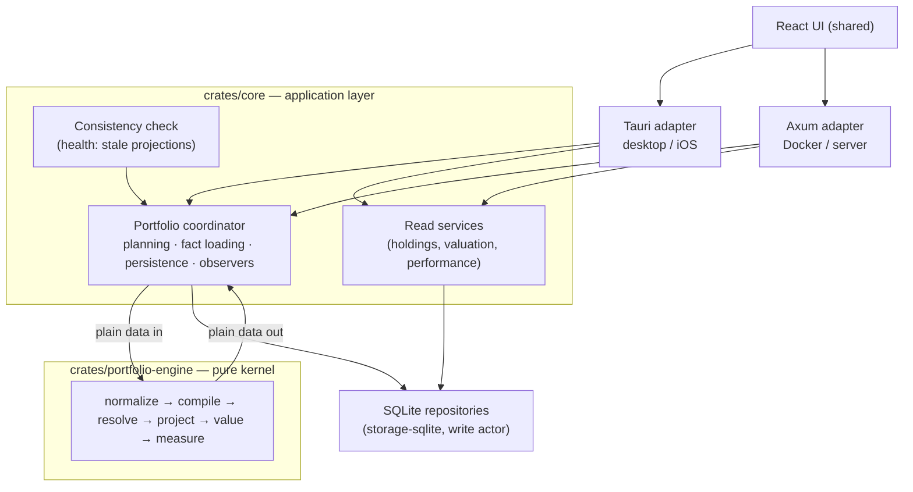

# Portfolio engine architecture

How Wealthfolio turns activities, quotes and exchange rates into holdings,
valuations and performance. The calculation path is split in two: a pure kernel
crate that owns the mathematics, and a shell that owns everything the answer
must not depend on — time, storage, network and scheduling.

## 1. Overview

`crates/portfolio-engine` is a **pure, deterministic calculation kernel**: facts
in, values out. It has no I/O, no clock, no locks and no async. The same facts
produce byte-identical results on any host, any day, any machine.

Six stages, each a total function of its arguments:

| Stage              | Input                                    | Output                                     |
| ------------------ | ---------------------------------------- | ------------------------------------------ |
| `normalize`        | raw rows (strings, UTC instants)         | typed, ordered facts with transfer pairs   |
| `compile`          | canonical facts                          | economic events (the single authority)     |
| `resolve_surfaces` | quotes, FX observations, split events    | resolved price and rate surfaces           |
| `project`          | events + surfaces + optional prior state | daily positions, cash, lots, disposals     |
| `value`            | projection + surfaces                    | dense daily valuations with typed statuses |
| `measure`          | valuations + events + lots + disposals   | returns, attribution, risk                 |

`crates/core` holds the **coordinator**: it decides what to recalculate, loads
the facts, calls the kernel, persists the results and tells the hosts what
happened. The two hosts (Tauri for desktop and iOS, Axum for server and Docker)
contribute UI events, authentication and scheduling — nothing else.

## 2. Design principles

**P1 — Single economics authority.** Every consumer (accounting, valuation,
performance, health) reads canonical `EconomicEvent`s produced by one compile
stage. Nothing downstream re-interprets a raw activity.

**P2 — Purity and determinism.** No clock, no I/O, no locks, no async inside the
kernel. "Today" and the user's timezone are policy fields, not ambient state.
Identical facts give identical bytes.

**P3 — Compile-time boundary.** The kernel's dependency list is the enforcement,
not a convention: adding a database or runtime crate is a build failure.

**P4 — Honest degradation.** Missing or invalid inputs produce typed statuses
and diagnostics. Never a silent zero, a silent `rate = 1`, a silent currency
default, or an account quietly dropped from a total.

**P5 — One coordinator, two hosts.** A single recalculation sequence serves both
hosts; host code is UI events, auth and scheduling.

**P6 — Provable incremental correctness.** A resumed or chunked run is equal to
a full fold by property law, not by hope, which is what makes incremental
rebuilds safe to run by default.

### Scope boundaries

- No event sourcing, CQRS, message brokers, durable queues or dirty-ledger
  tables. Consistency is re-derived from facts on demand (§3.3).
- No microservices, actor frameworks, dependency-injection containers or
  incremental-computation frameworks. This stays a modular monolith.
- No new formats for the existing read models: sparse keyframes, dense daily
  valuation rows, lot and disposal rows keep their shapes. Two additive tables
  support the lifecycle: `projection_watermarks` and `projection_checkpoints`.
- Market-data fetching, broker sync, device sync and the frontend are outside
  this architecture.
- Cost basis is FIFO. LIFO and pooled average cost are designed for but not
  implemented; unsupported settings fail loudly per account rather than being
  silently computed as FIFO.

## 3. System architecture

### 3.1 Topology

Two hosts, three deployment forms, one calculation kernel.



The kernel knows nothing about Tauri, iOS, Axum, Docker, async runtimes or
SQLite. In-memory domain events remain the intra-process signal that something
changed.

### 3.2 Responsibility split

| Concern                                                                                 | Kernel                  | Shell    |
| --------------------------------------------------------------------------------------- | ----------------------- | -------- |
| Economic interpretation of activities (transfer pairing, flow classification)           | owns                    | —        |
| Position, cash, lot and net-contribution projection                                     | owns                    | —        |
| Quote and FX **resolution** (carry, minor units, inverse, triangulation, split factors) | owns as explicit policy | —        |
| Quote and FX **fetching** (providers, retry, sync)                                      | —                       | owns     |
| Daily valuation, flow finalisation, performance math                                    | owns                    | —        |
| What to recalculate, when, for whom                                                     | —                       | owns     |
| Persistence, batching, transactions                                                     | —                       | owns     |
| Caching, single-flight, parallelism                                                     | enabled by purity       | owns     |
| Event emission, auth, scheduling, UI                                                    | —                       | owns     |
| Clock ("today") and user timezone                                                       | parameters              | supplies |

The rule: anything whose answer could differ between two machines (network,
disk, clock, cache) is shell; anything two machines must agree on given the same
facts is kernel.

**Persistence shapes.** Snapshots are sparse keyframes (first day and activity
days); valuations are dense daily rows. The kernel emits the dense series and
the shell keeps the existing cadence. Lots and disposals are read models derived
from the same projection state. Each account's rows and its watermark are
written in **one transaction**, so a projection never half-lands.

### 3.3 Recalculation lifecycle

Hosts suspend, close and restart mid-work. Rather than durable messaging, the
architecture re-derives what is stale from the facts themselves.

**Facts fingerprint.** Each account carries a `projection_watermarks` row: the
fingerprint of every fact source the kernel read, the day the projection covers,
and when it ran. The fingerprint contains the account's activity count and last
edit, the same for its transfer counterparties, the account row and its
accounting settings, the referenced asset rows, a content hash of observed
snapshots, the policy (base currency, timezone), and **content hashes** of the
quotes and FX rates read. Market data is hashed by day and value, not by row
timestamp, so a provider re-upserting identical closes does not make every
account stale.

**Plans.** A job compares each account's current fingerprint against its
watermark and picks the cheapest correct path:

| Verdict                                                                         | Plan        | Work                                                              |
| ------------------------------------------------------------------------------- | ----------- | ----------------------------------------------------------------- |
| Fingerprint matches, projection covers today                                    | **Skip**    | nothing                                                           |
| Only quotes, FX or the day moved                                                | **Revalue** | re-run `value` over stored keyframes; rewrite valuation rows only |
| Facts changed and a checkpoint precedes the change                              | **Resume**  | fold from that checkpoint; replace rows from there on             |
| No usable checkpoint, undated deletion, settings change, or an explicit rebuild | **Full**    | fold from the first activity                                      |

**Checkpoints.** The fold runs in chunks; each chunk's end state is stored per
account in `projection_checkpoints` (calendar year ends plus the last projected
day), carrying the in-flight transfer cache so a paired transfer survives a
chunk boundary. A resume rebuilds the closure's state from those rows and hands
it to `project` as its starting state. Chunk equivalence (I2) is what makes this
identical to a full fold.

**Dating a change.** Activity events carry the earliest changed instant into the
job, so a deletion — whose row no longer exists to date — can still resume.
Edits and insertions are dated from their rows. An undated change falls back to
a full fold.

**Job discipline.** Jobs are serialised per account by lock, never skipped, so a
later request always sees the facts it was raised for. In-process failures
(storage, engine) retry with backoff; per-account validation failures are final
and reported individually. Event batches debounce with a bounded maximum wait,
so a sustained event stream cannot postpone work indefinitely.

**Entry points.** One idempotent consistency pass serves cold start, the
frontend's return to the foreground, the periodic market-data sync, and
device-sync apply. Stale accounts also surface in the health check with a repair
action.

**Scoping.** Facts load by account and transfer group, transitively: a job reads
its scope's transfer closure, never the whole activity table. Archived accounts
stay visible to pairing so a transfer to or from them classifies correctly.

## 4. The kernel crate

### 4.1 Dependency contract

```
crates/portfolio-engine/
├── Cargo.toml            # runtime deps: the closed list below
├── src/
│   ├── lib.rs            # public API: the six stages + facts_needed
│   ├── model/            # scalars, Policy, facts, events, states, reports
│   ├── normalize.rs      # stage 1: parsing, ordering, transfer pairing
│   ├── compile.rs        # stage 2: the single economics authority
│   ├── resolve.rs        # stage 3: quote and FX surfaces
│   ├── project.rs        # stage 4: the fold
│   ├── value.rs          # stage 5: pricing and flow finalisation
│   ├── measure.rs        # stage 6: returns, attribution, risk
│   └── diagnostics.rs
└── tests/                # scenarios, goldens, property laws (§5)
```

**Runtime dependencies (closed list):** `chrono` (date arithmetic; the clock
feature is never used), `chrono-tz` (IANA zone tables, pure data),
`rust_decimal` (+ macros), `serde`, `thiserror`. Dev-dependencies (`insta`,
`serde_yaml`, `serde_json`, `criterion`) never enter the runtime tree.

**Dependency direction:** hosts → `core` → `portfolio-engine`. The kernel
depends on no workspace crate, which is what makes the boundary mechanical: a
kernel that cannot name a repository cannot query one.

**Decimal serialisation.** The workspace enables `rust_decimal` with
`serde-float`, and Cargo unifies features across the graph. Every serialised
decimal in the kernel therefore uses explicit string (de)serialisation, so a
checkpoint or golden never loses precision through a float round-trip.

### 4.2 Domain model

All types are plain data: `Clone + Debug + PartialEq + Serialize + Deserialize`.
No `Arc`, no trait objects, no interior mutability.

**Scalars — parse, don't validate.** Built once in `normalize`; later stages
never see a raw string.

```rust
pub struct Currency(/* validated code; a bucket key and FX-pair component.
                       Minor-unit relations are Policy DATA, not knowledge
                       baked into the type. */);
pub struct AccountId(String);       // opaque
pub struct AssetId(String);         // opaque
pub struct ActivityId(String);
pub struct EventId(String);         // synthetic legs keep traceable ids
```

Money carries its currency, quantities are signed (negative means short), and a
business date is the UTC instant converted through `Policy.timezone` exactly
once. This removes by construction the class of bugs where a date is a string, a
decimal parse falls back to zero, or an amount has no currency.

**Facts — the complete world the kernel may know.** `RawFacts` mirrors database
rows (the only place strings are allowed) and is a **per-invocation scope, not
the database** (§4.8):

```rust
pub struct RawFacts {
    pub policy: Policy,
    pub accounts: Vec<RawAccount>,       // currency, type, tracking mode, archived
    pub assets: Vec<RawAsset>,           // quote currency, kind, instrument, multiplier
    pub activities: Vec<RawActivity>,    // full row incl. subtype, override, status,
                                         //   group id, supplied fx rate, created_at
    pub quotes: Vec<RawQuote>,           // observations, not resolutions
    pub fx_rates: Vec<RawFxRate>,        // observations
    pub observed_snapshots: Vec<RawObservedSnapshot>, // holdings-mode FACTS
}
```

Observed snapshots are **facts, not projections**. A holdings-tracked account's
positions were entered by a person or a broker; the kernel values them but never
derives them, and persistence may only replace what the kernel produced.

**Policy — every tunable explicit.**

```rust
pub struct Policy {
    pub base_currency: Currency,
    pub timezone: Tz,                 // UTC instant → business date, once, in normalize
    pub as_of: NaiveDate,             // "today" is data, never a clock read
    pub minor_units: Vec<MinorUnitRule>, // GBp→GBP ×0.01, ZAc→ZAR, KWF→KWD ×0.001, …
    pub cost_basis: CostBasisMethod,  // FIFO
}
```

The minor-unit table is data: a new minor unit is a data change, not an engine
release. Where normalisation applies is kernel law — activity currencies in
`normalize`, quote closes and FX pairs in `value`.

**`EconomicEvent` — the single authority.** Nothing downstream reads a raw
activity. One type absorbs what used to be five partial interpretations:
composite expansion (dividend reinvestment, staking rewards, dividends in kind),
cash resolution (sign by type, supplied amount authoritative, charges
separated), the transfer flow ladder, scope classification and lot instructions.

```rust
pub struct EconomicEvent {
    pub id: EventId,                 // {activity}:dividend, {activity}:buy for legs
    pub source: ActivityId,          // traceability from number back to fact
    pub account: AccountId,
    pub date: NaiveDate,
    pub timestamp: DateTime<Utc>,
    pub sequence: u32,               // position in the ledger's total order
    pub currency: Currency,
    pub cash: Option<CashEffect>,    // signed final cash, before booking
    pub charges: Charges,            // fees and taxes, classified
    pub action: Action,              // trade | security transfer | split | option expiry
    pub contribution: Contribution,  // net-contribution effect
    pub flow: Flow,                  // external-flow classification and provenance
    pub diagnostics: Vec<Diagnostic>,
}
```

**Flow provenance.** A flow carries its scope (a matched internal transfer is
external to an account and zero to the portfolio) and how its amount was
obtained: cash amount, quote-derived market value, cost-basis fallback,
removed-lot basis, legacy amount, unknown boundary. Provenance gates return
eligibility and never upgrades under aggregation.

**Transfer pairing** is resolved in `normalize` from the transfer group id only,
deterministically. A group with a leg count other than two, mismatched assets,
or quantities differing by more than a tolerance is unpaired and yields a
diagnostic. Same-account, two-currency cash conversions are valid pairs.

**Deferred flows.** Two ladder steps cannot be priced at compile time because
they need later outputs: the removed-lot-basis fallback for an unquoted security
transfer out (needs disposals from `project`) and holdings-mode transition flows
(need keyframe valuations from `value`). `compile` marks them deferred and
`value` finalises them, so `measure` only ever sees final amounts.

**Outputs.**

```rust
pub struct CompiledLedger  { events: Vec<EconomicEvent>, diagnostics: Vec<Diagnostic> }
pub struct ProjectionState { /* positions, FIFO lot book, cash by currency,
                                cost basis, net contribution, in-flight transfer
                                cache — the state at one date, and the persisted
                                checkpoint that makes a resume possible */ }
pub struct ProjectionBundle{ keyframes, final_state, disposals, closures, diagnostics }
pub struct ValuationSeries { /* dense daily values, statuses and final flows */ }
pub struct PerformanceResult{ /* TWR, IRR, value return, attribution, risk,
                                 summary, series, data quality */ }
```

**Status model.** A daily valuation carries `value_status` (`Complete`,
`PartialUnpriced`, `Unavailable`) and `basis_status` (`Complete`,
`PartialUnknown`, `Unknown`, `NotApplicable`), each combining under absorption
laws where degradation never upgrades. Richer detail — how old a carried quote
is, which FX pair was missing, which fallback fired — travels in diagnostics
rather than multiplying status values.

### 4.3 Stage contracts

```rust
/// 1. Strings and instants become types, once. Applies the total order
///    (business date, timestamp, created_at, id), resolves transfer pairs,
///    drops non-posted activities. Bad data becomes diagnostics here.
pub fn normalize(raw: RawFacts) -> Result<Normalized, EngineError>;

/// 2. The single economics authority: total over the activity vocabulary
///    (Appendix A). Every (effective type, subtype, status) maps to events
///    or to a diagnostic.
pub fn compile(facts: &CanonicalFacts) -> CompiledLedger;

/// 3. Resolve quote and FX surfaces ONCE over the full range: carry-forward
///    with age, minor-unit normalisation, direct/inverse/nearest/multi-hop FX
///    with provenance, split-factor detection and the per-asset factor
///    schedule. The output is DATA; later stages never consult raw
///    observations, so chunking cannot change a resolution verdict.
pub fn resolve_surfaces(facts: &CanonicalFacts, range: DateRange) -> ResolvedSurfaces;

/// 4. Fold events into daily state. Incremental is the same fold with a prior
///    state as input: project(A..B) then project(B..C from state(B))
///    ≡ project(A..C) (I1, I2). Cross-account transfer ordering and the
///    paired-lot cache live inside the fold, and the cache is part of the
///    state so a checkpoint carries in-flight transfers across a boundary.
pub fn project(
    ledger: &CompiledLedger,
    facts: &CanonicalFacts,
    fx: &FxResolver<'_>,             // acquisition-date FX for lot basis
    start: Option<ProjectionState>,  // None = from genesis
    range: DateRange,
) -> Result<ProjectionBundle, EngineError>;

/// 5. Price the states from the resolved surfaces; report per-day status and
///    diagnostics; finalise deferred flows. Holdings-mode accounts are valued
///    from their observed snapshots instead of the projection.
pub fn value(inputs: &ValueInputs<'_>) -> BTreeMap<AccountId, ValuationSeries>;

/// Scope aggregation: per-day sums in base currency with internal transfers
/// (both legs in scope) netted out.
pub fn aggregate_scope(
    resolved: &Resolved<'_>,
    disposals: &[LotDisposal],
    series: &BTreeMap<AccountId, ValuationSeries>,
    scope: &[AccountId],
    window: Window,
) -> Result<ValuationSeries, String>;

/// 6. Returns over the valuation series: TWR (chain-linked, with the
///    fatal/benign/pre-chain day taxonomy), IRR (bisection, annualised),
///    value return, holdings-mode book-basis returns, attribution with a
///    residual term, risk, annualisation behind a minimum-window gate.
///    The series alone is not sufficient — attribution needs ledger events,
///    disposals and the FX surface — hence MeasureInputs.
pub fn measure_account(
    inputs: &MeasureInputs<'_>,
    account: &AccountId,
    window: Window,
    profile: MeasureProfile,         // Full | Summary | Dashboard
) -> Result<PerformanceResult, EngineError>;

pub fn measure_scope(
    inputs: &MeasureInputs<'_>,
    scope_id: &str,
    scope: &[AccountId],
    window: Window,
    profile: MeasureProfile,
) -> Result<PerformanceResult, EngineError>;

/// Lot read models derived from a projection bundle.
pub fn lot_records(
    bundle: &ProjectionBundle,
    facts: &CanonicalFacts,
    fx: &FxResolver<'_>,
) -> Vec<LotRecord>;

/// What the shell must load for a scope and range: assets, currency pairs,
/// the observation window and the transfer-pair closure. Pure.
pub fn facts_needed(
    facts: &CanonicalFacts,
    scope: &[AccountId],
    range: DateRange,
) -> FactsRequest;
```

`MeasureProfile` exists because callers need different depths: the dashboard
card needs the exact value change net of flows and no attribution, a summary
needs returns without IRR, risk or a series, and the performance page needs
everything. The profile is an input, not a post-hoc trim, so the work is never
done and thrown away.

**Pre- and post-conditions.**

- No stage performs I/O, reads a clock, spawns or locks. All are total functions
  of their arguments.
- No stage panics on user data. Panics are reserved for internal invariant
  violations, which the property suite hunts.
- Inputs are data-complete. An unresolvable rate is a typed degradation and a
  diagnostic, never a fetch, a silent `rate = 1`, or an unconverted addition.
- Chunking is the caller's right: `project` and `value` may run over sub-ranges
  with the state folded forward. `resolve_surfaces` is never chunked.
- Per-activity atomicity: a failing activity contributes a diagnostic and zero
  state mutation, never a partial application.

### 4.4 Errors and diagnostics

Two channels, deliberately distinct:

- **`EngineError`** — the _request_ is unusable: an inverted range, an invalid
  policy, a prior state that does not meet the range start. The caller made a
  mistake and there is no result.
- **`Diagnostic`** — the _data_ is imperfect: an unparseable decimal, a missing
  currency, an unknown subtype, a missing quote, an unresolvable pair, an
  unpaired transfer, a negative balance. It is attached to the event or day it
  affects, carries a code, a severity and source ids, and is aggregated on the
  bundle or series. Health checks render them and the UI can badge them. They
  are never dropped and never become zeros.

### 4.5 Degradation semantics

Typed degradation is a design rule, not an error path, and it decides what the
product shows when the inputs are imperfect.

- **A day is `Unavailable`** when the account cannot be converted to base, a
  held currency cannot be converted to the account currency, or nothing at all
  could be valued. The row still exists, with account-currency columns filled
  and base columns zero, plus a diagnostic naming the missing pair. Rows are
  never dropped: a missing row is a silently wrong total, whereas a marked row
  is a fact the reader and the health check can act on. Chart consumers skip
  unavailable days rather than plotting a partial value.
- **A day is `PartialUnpriced`** when some held position has no quote anywhere.
  It contributes zero to market value, the day's returns are computed on the
  priced subset, and a warning says so.
- **Returns follow coverage.** TWR excludes any day pair touching an unavailable
  day or an unknown flow. When a period **endpoint** is unavailable, IRR, value
  return, the headline amount and the P&L breakdown are all unavailable: a gain
  cannot be stated when one end of the period has no value. Contributions and
  distributions, which are known, are still reported.
- **An empty currency is not a bucket key.** A row whose currency is missing is
  computed in the account currency with a diagnostic, rather than accumulating
  in an unnamed bucket that no rate can ever convert. An asset without a quote
  currency stays unknown: its positions take the currency of the activity that
  opens them and its quotes need an explicit currency, never a default.
- **Archiving is a scope boundary.** An archived account is outside the tracked
  portfolio, so transfers to it are external outflows and transfers from it are
  external inflows, priced like any other flow. Pairing still resolves, so the
  amount is known rather than an unknown boundary. A scope that explicitly
  includes the archived account nets both legs to zero, as for any internal
  transfer.
- **An unpriceable holding is not a total loss.** A position whose asset has no
  quote makes the day unavailable rather than valuing it at zero, which would
  otherwise report a complete −100 % return for an asset the system simply could
  not price.
- **A carried quote is visible when it matters.** Prices carry forward from the
  last observation. A carry of a week or more is reported once per account and
  asset as an informational diagnostic with its age, so a stale series is never
  mistaken for a live one; shorter carries (weekends, holidays) are silent.
- **A non-positive price or rate is a broken row.** Quote closes and FX rates at
  or below zero are dropped at normalise with a diagnostic instead of being
  used, so a glitch cannot value a position at nothing or a bucket at zero while
  the day reads complete.
- **Unsupported settings fail loudly.** An account configured for a cost-basis
  method the kernel does not implement fails with a per-account error instead of
  being computed as FIFO and labelled FIFO.

### 4.6 Invariants

Testable contract; the property suite (§5) encodes each one.

| ID      | Invariant                                                                                                                                                                                                           |
| ------- | ------------------------------------------------------------------------------------------------------------------------------------------------------------------------------------------------------------------- |
| **I1**  | **Replay equivalence.** `project(genesis..T)` ≡ `project(D..T, from state(D−1))` for any D, given a lossless typed checkpoint. This is what makes resume safe.                                                      |
| **I2**  | **Chunk equivalence.** Any partition of a range, folding the final state forward, yields identical daily states to a one-shot run.                                                                                  |
| **I3**  | **Determinism.** Identical facts, including `as_of` and policy, give byte-identical output regardless of machine, clock or input vector order.                                                                      |
| **I4**  | **Cash conservation.** Per account and currency: closing cash = opening cash + Σ cash postings. Cash never appears or vanishes outside events.                                                                      |
| **I5**  | **Position and lot conservation.** Position quantity = Σ postings; open-lot effective quantities sum to the position; positions stay single-signed per asset; closed lots never mutate.                             |
| **I6**  | **Split invariance.** A split changes lot split ratios only, for lots acquired before its local date: never value at the split instant, never cost-basis totals, never flows, never cash.                           |
| **I7**  | **Transfer scope.** A matched internal transfer is equal and opposite at account scope and zero at portfolio scope when both accounts are in scope; paired security transfers preserve acquisition dates and basis. |
| **I8**  | **Valuation reconciliation.** Day over day, `Δvalue = flows + event effects + market and FX movement + unreconciled`, where the residual is an explicit diagnostic term, never silently absorbed.                   |
| **I9**  | **Aggregation.** Portfolio valuation = Σ account valuations for the same day and policy; portfolio flows = account flows net of internal transfers; statuses and provenance combine by their absorption laws.       |
| **I10** | **Degradation honesty.** Every carried, missing, estimated or fallback input is visible in a status or a diagnostic. No silent zeros, no silent `rate = 1`, no silent currency default, no silent fills.            |

### 4.7 Determinism rules

- `as_of` and the timezone are policy fields; the kernel never reads a clock.
- An activity's calendar date is its UTC instant converted through the policy
  timezone, computed once in `normalize`.
- Same-day ordering is a **total order**: business date, then source timestamp,
  then row creation time, then activity id. Creation time matters because
  date-only imports stamp every row of a day at the same instant, and folding a
  sale before its purchase would change the result.
- Cross-account same-day transfers fold in topological order, source before
  destination.
- Composite legs preserve their order: the income leg precedes the buy leg.
- Every ordering, pairing, expansion and detection rule keys on the
  **effective** activity type, so an override is honoured everywhere or nowhere.
- One quote per asset and day: when several sources quote the same day, the
  manual price wins, then a provider's, then a broker's, then the source name,
  so the input order of rows never decides a valuation.
- Iteration in any output-affecting path uses ordered maps. FX paths are chosen
  by fewest hops, then lexicographic currency codes, so equal-length
  triangulations never resolve by hash order.
- Rounding is a policy applied at defined points (posting, valuation, report),
  not ad hoc.
- FX nearest-neighbour resolution may look forward in time. A valuation is
  deterministic given the surface, and the surface is part of the facts; a
  late-arriving rate changing history is therefore a recalculation trigger for
  the shell (the market-data fingerprint), not a kernel concern.

### 4.8 Memory envelope and scoping

`RawFacts` is a per-invocation scope, not the database.

- **Magnitudes are modest.** A heavy portfolio — 100k activities, 200 assets, 10
  years — is tens of megabytes of activities and around a hundred of sparse
  quote observations. That is the load-everything worst case, which the shell
  never needs.
- **`facts_needed` is the scoping mechanism.** A per-account run loads that
  account's activities and its assets' observations plus the transfer-pair
  closure. A chunked run loads observations covering the chunk plus the nearest
  observation on each side of its boundaries, bounded without loading history.
- **Parallelism granularity.** `value` and `measure` are per account and
  parallelise freely. `project` folds a transfer-closure group: accounts
  connected by transfers must fold together, unconnected groups are independent.

## 5. Verification architecture

The kernel is verified by fixtures rather than mocks: every test is facts in,
values out.

| Harness           | What it checks                                                                                                                                 |
| ----------------- | ---------------------------------------------------------------------------------------------------------------------------------------------- |
| Scenario fixtures | One YAML file per scenario: facts, intent, and expected notes in prose. Nominal, edge, regression, performance and lifecycle families.         |
| Kernel goldens    | Reviewed snapshots of full engine output per scenario: keyframes, lots, disposals, valuations with statuses, flows, performance windows.       |
| Property laws     | The invariants of §4.6 over the whole corpus: determinism, chunk equivalence, conservation, split neutrality, transfer cancellation, honesty.  |
| Coordinator tests | The shell path: real fact loading, row mapping, persistence, freshness verdicts, plan selection, and lifecycle steps equal to a fresh rebuild. |
| Scale benchmark   | The six stages over a generated 20k-activity portfolio.                                                                                        |

`crates/portfolio-engine/tests/fixtures/README.md` documents the fixture schema,
the golden format, the harnesses and how to verify a fixture by hand.

**Provenance of the behaviour.** The kernel was built against an oracle: goldens
captured from the previous calculation pipeline, compared field by field on
every scenario, with each intentional difference itemised, reviewed and signed
before it was accepted. That harness was retired once the sign-off was complete;
the decisions it produced are the semantics recorded in §4.5, and the capture
itself remains in this repository's history.

## Appendix A — Activity vocabulary

The compile stage is total over this vocabulary: 14 activity types, 10 canonical
subtypes with broker-alias canonicalisation (BTO, BTC, STO, STC, SELL_SHORT and
BUY_TO_COVER map onto POSITION_OPEN and POSITION_CLOSE), and 4 statuses, of
which only `Posted` computes. An `activity_type_override` wins everywhere.

Monetary and quantity accessors return absolute values: direction comes solely
from the type. A supplied amount is **authoritative** final cash, with an
explicit zero trusted. The runtime never derives cash: a posted row that needs
final cash but stores none has no cash effect and a `MissingFinalCash`
diagnostic. Deriving `gross = |qty| × |price| × multiplier ± charges` is a
writer-side concern at the persistence boundary, outside the kernel. Security
transfers (non-empty asset) book only their fee as cash, and a transfer in
additionally capitalises that fee into the lot basis. A split has no cash
effect.

| Type         | Cash sign × amount                                                                                                              | Position and lots                                                                                                                                    | Net contribution                                         | Flow (portfolio scope)                                                                                                         |
| ------------ | ------------------------------------------------------------------------------------------------------------------------------- | ---------------------------------------------------------------------------------------------------------------------------------------------------- | -------------------------------------------------------- | ------------------------------------------------------------------------------------------------------------------------------ |
| BUY          | − amount; gross = amount − charges                                                                                              | + qty; opens a lot (basis = gross + charges); a short cover uses POSITION_CLOSE intent with cash prorated to the covered quantity                    | —                                                        | Internal                                                                                                                       |
| SELL         | + amount; − amount when charges exceed proceeds and the derivation reproduces the stored amount within tolerance (NOM-TRADE-05) | − qty; FIFO close with realised P&L; a short open uses POSITION_OPEN intent (negative lot); a sell with no position is cash only + warning           | —                                                        | Internal                                                                                                                       |
| DIVIDEND     | + amount                                                                                                                        | — (DRIP and dividend-in-kind expand into two legs first)                                                                                             | —                                                        | Internal                                                                                                                       |
| INTEREST     | + amount; on credit-card accounts − amount (EDGE-CC-01)                                                                         | — (staking rewards expand)                                                                                                                           | —                                                        | Internal                                                                                                                       |
| DEPOSIT      | + amount                                                                                                                        | —                                                                                                                                                    | **+ amount**                                             | **External**                                                                                                                   |
| WITHDRAWAL   | − amount; gross = amount − charges                                                                                              | —                                                                                                                                                    | **− amount**                                             | **External**                                                                                                                   |
| TRANSFER_IN  | cash variant: + amount · security variant: − fee only                                                                           | security: paired lots via the transfer cache (dates and basis preserved, opposite-sign residents netted first), else the book-basis fallback ladder  | cash: + amount · security: + lot basis at acquisition FX | External when marked; pair resolved **and both accounts in scope** → Internal; unpaired and unmarked → Unknown (gates returns) |
| TRANSFER_OUT | cash variant: − amount · security variant: − fee only                                                                           | security: FIFO removal on the net-sign leg; disposal proceeds = basis (P&L 0); removed lots staged for the pair                                      | cash: − amount · security: − removed basis               | as TRANSFER_IN                                                                                                                 |
| FEE          | − amount                                                                                                                        | —                                                                                                                                                    | —                                                        | Internal                                                                                                                       |
| TAX          | − amount                                                                                                                        | —                                                                                                                                                    | —                                                        | Internal                                                                                                                       |
| SPLIT        | **none**                                                                                                                        | multiplies the split ratio of lots acquired before the split's local date; ratio from amount, else quantity; a fractional cashout is a separate sell | —                                                        | Internal                                                                                                                       |
| CREDIT       | + amount                                                                                                                        | —                                                                                                                                                    | **+ amount only for subtype BONUS**                      | External for BONUS, else Internal                                                                                              |
| ADJUSTMENT   | none                                                                                                                            | OPTION_EXPIRY: FIFO removal at zero proceeds (basis becomes a realised loss); other subtypes are no-ops                                              | —                                                        | Internal                                                                                                                       |
| UNKNOWN      | none                                                                                                                            | none (warn and skip)                                                                                                                                 | —                                                        | Internal                                                                                                                       |

**Subtypes.** `DRIP` (dividend into two legs), `STAKING_REWARD` (interest into
two legs), `DIVIDEND_IN_KIND` (two legs), `BONUS`, `REBATE`, `REFUND` and
`REIMBURSEMENT` (credit variants, of which only BONUS is external capital),
`OPTION_EXPIRY`, and `POSITION_OPEN` / `POSITION_CLOSE` (trade intent). A
two-leg expansion puts the income leg first and carries fee and tax there; the
buy leg carries the income as its amount, so net cash is about zero, with price
precedence: explicit positive unit price, then amount over quantity, then the
raw unit price.

**Cross-cutting rules.** Income attribution is gross. Fees and taxes are
attributed for trades, income and standalone charge rows; fees on deposits,
withdrawals and transfers are booked to cash but knowingly not attributed.
Shortability: options may go negative implicitly, equities require explicit
intent, everything else rejects a negative lot. Cash books into the account
currency at the supplied rate when the activity carries one and the currencies
differ, otherwise into the activity-currency bucket; an empty currency is a
diagnostic, never a bucket key.

## Glossary

- **Facts** — inputs the kernel may know: activities, quotes, FX rates, assets,
  observed snapshots, policy. Never derived data.
- **Projection** — anything rebuildable from facts: derived keyframes, lots,
  disposals, valuations, performance. Deletable and recomputable by definition.
- **Surface** — an indexed set of observations (quotes or FX) over a date range
  plus lookback. Resolution over a surface is kernel policy.
- **Provenance** — how a flow amount was obtained. Gates return eligibility and
  never upgrades under aggregation.
- **Deferred flow** — a compile-stage flow whose amount needs a later stage's
  output; finalised in `value`, consumed by `measure`.
- **Watermark** — the per-account record of the last projection: the facts
  fingerprint it was computed from, the day it covers and when it ran.
- **Checkpoint** — the projection state at a chunk boundary, stored per account,
  from which a later run resumes.
- **Plan** — the verdict for one account in one job: skip, revalue, resume or
  full.
- **Scope** — the set of accounts a computation covers. Internal transfers net
  to zero inside it; everything crossing its boundary is an external flow.
- **Transfer closure** — the scope plus every account sharing a transfer group
  with it, transitively. The unit a fold must cover.
